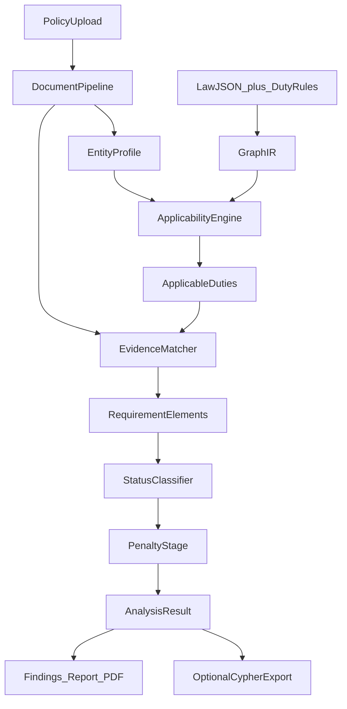

# Compliance Reasoning Engine Implementation Plan

> **For agentic workers:** REQUIRED SUB-SKILL: Use superpowers:subagent-driven-development (recommended) or superpowers:executing-plans to implement this plan task-by-task. Steps use checkbox (`- [ ]`) syntax for tracking.

**Goal:** Turn PolarisLex from a clause-to-duty matcher into an applicability-aware, evidence-backed reasoning engine so the BharatPay PASS policy is not scored as 21/22/20 against 63 unfiltered duties.

**Architecture:** Keep `/analyze` on in-process GraphIR + Qdrant. Add a deterministic pipeline in front of and after scoring: profile → applicable duties → multi-clause evidence → element scoring → status → penalty eligibility. Cypher is generated from the same GraphIR (optional Neo4j export), not required at analyze time. Qwen still writes memo prose only.

**Tech Stack:** Python `compliance/` engine, four `*_graph.json` catalogs, sidecar rule JSON, existing Qdrant `kg_obligation` + `document_clauses`, React Findings/Report/graph in `web/`.

## Assessment of the developer plan

The BharatPay result (**21 covered / 22 partial / 20 missing / 63 total** across DPDP, SPDI, IT Act, CERT-In) is a real product failure. The diagnosis is correct:

- There is **no applicability layer**. [`analyze_document`](compliance/src/compliance/service.py) scores every GraphIR Obligation from all four law files. `applicable_laws` is just `sorted({row.act})`.
- **IT Act CA / e-sign duties leak in** because they also carry kept topics (`TOPIC_SECURITY`, `TOPIC_DISCLOSURE`). Topic filter is not an entity filter. Six duties still score: `ITACT_SEC_15`, `ITACT_SEC_30`, `ITACT_SEC_34`, `ITACT_SEC_26`, `ITACT_SEC_42_SUB_1`, `ITACT_SEC_42_SUB_2`.
- **`DPDP_SEC_8_SUB_5` MISSING** is explained by the matcher, not the parser. Exclusive **top-1 per clause** ([`service.py` lines 77–92](compliance/src/compliance/service.py)) lets a security paragraph credit CERT-In or IT Act instead of DPDP. Title-token gate needs `{security, safeguards}`; “Data Security” / encryption lists can fail it. The existing test `test_only_best_catalog_hit_is_credited` **encodes this bug as a contract** and must be replaced.
- Penalties attach to every **non-covered** duty ([`service.py` 133–150](compliance/src/compliance/service.py)). Copy never says “violation,” but the memo still implies missing language → statutory exposure.
- Statuses are only `covered | partial | missing`. `NOT_APPLICABLE` / `UNDETERMINED` / `VIOLATION` / `CONFLICT` do not exist. Scoreboard uses **covered / total scored duties**, so CA duties dilute BharatPay.

What is **already aligned** with the doc (do not rebuild):

- LLM is not the classifier ([`report.py` SYSTEM prompt](compliance/src/compliance/report.py)).
- GraphIR Obligation nodes + `PENALIZES` walk; no Bolt on `/analyze`.
- Reference *detection* exists in `document_pipeline` (`ReferenceDetector`); resolution is `semantic_graph` `ReferenceResolver` (policy-internal “see Section 9” is not yet used as evidence).
- `IMPOSES_DUTY_ON` entities already exist on catalog rows; they are unused at analyze time.

What to **not take literally** even in the full roadmap:

- **Do not invert to LLM-first candidate extraction** (doc §11). That fights the current correct design. LLM may *annotate* elements; rules still classify.
- **Do not require Neo4j Cypher at `/analyze`.** Build the recommended graph *as GraphIR relationships* (`MATCHED_BY`, `HAS_REQUIREMENT`, `SUPPORTED_BY`, `CONFLICTS_WITH`, `MAY_TRIGGER`). Emit Cypher for export/debug; Bolt remains optional.
- **Do not drop SPDI just because DPDP exists.** Score SPDI as `SUPERSEDED` / continuing with an explicit reason, not as a present-day DPDP failure.
- **MISSING must stay.** It means “no policy evidence,” not liability. VIOLATION is a separate, evidence-of-contradiction status.

## Global constraints

- `/analyze` remains GraphIR + Qdrant; no Bolt required.
- Qwen must not invent statuses, obligation ids, or penalties.
- `not_applicable` is excluded from coverage denominator and from `gaps`.
- Missing policy language is never labeled a violation and never implies determined liability.
- Penalty rows carry `eligibility`, `confidence`, `trigger_condition`, and `not_a_determination_of_liability`.
- Same input + same `duty_rules` version → same statuses (deterministic).
- India website-privacy MVP: default profile is `privacy_policy` + Data Fiduciary / body corporate. No pluggable jurisdictions.

## File map

- **Create:** [`compliance/data/law_versions.json`](compliance/data/law_versions.json) — per-act status, commencement, supersedes, `still_scored`.
- **Create:** [`compliance/data/duty_rules.json`](compliance/data/duty_rules.json) — per `obligation_id`: roles, document_types, requirement_elements, severity, contradiction cues, specificity terms.
- **Create:** [`compliance/src/compliance/applicability.py`](compliance/src/compliance/applicability.py) — profile + law version + role/document filters → `not_applicable` + reason.
- **Create:** [`compliance/src/compliance/matching.py`](compliance/src/compliance/matching.py) — multi-credit retrieval, evidence quality, element aggregation, specificity.
- **Create:** [`compliance/src/compliance/classify.py`](compliance/src/compliance/classify.py) — status + confidence from evidence + elements.
- **Create:** [`compliance/src/compliance/penalty_stage.py`](compliance/src/compliance/penalty_stage.py) — eligibility after status.
- **Create:** [`compliance/src/compliance/explain.py`](compliance/src/compliance/explain.py) — why matched / partial / n/a / penalty copy (engine-owned).
- **Create:** [`compliance/src/compliance/cypher_export.py`](compliance/src/compliance/cypher_export.py) — Cypher strings from GraphIR + matches (no runtime Bolt).
- **Create:** [`compliance/tests/benchmark/`](compliance/tests/benchmark/) — gold JSON for PASS / FAIL / PARTIAL / N-A / AMBIGUOUS.
- **Modify:** [`compliance/src/compliance/models.py`](compliance/src/compliance/models.py), [`service.py`](compliance/src/compliance/service.py), [`graph_scope.py`](compliance/src/compliance/graph_scope.py), [`catalog.py`](compliance/src/compliance/catalog.py), [`report.py`](compliance/src/compliance/report.py), [`pdf.py`](compliance/src/compliance/pdf.py).
- **Modify:** [`graph_builder/src/graph_builder/catalog_ir.py`](graph_builder/src/graph_builder/catalog_ir.py) — RequirementElement nodes + `HAS_REQUIREMENT` / `SUPPORTED_BY` / `MATCHED_BY`.
- **Modify:** [`policy_compare/src/policy_compare/api.py`](policy_compare/src/policy_compare/api.py) — optional `analysis_date`, `roles`; pass profile into analyze.
- **Modify:** [`web/src/Findings.jsx`](web/src/Findings.jsx), [`ReportPanel.jsx`](web/src/ReportPanel.jsx), [`CoverageStrip.jsx`](web/src/CoverageStrip.jsx), [`paintAnalysis.js`](web/src/paintAnalysis.js), [`GraphBoard.jsx`](web/src/GraphBoard.jsx), [`index.css`](web/src/index.css).
- **Modify:** [`plan.md`](plan.md) — mark Later `applies_if` / N/A as this slice; Cypher-at-analyze stays optional export.

Sidecar JSON is the ontology source of truth so the four large `*_graph.json` files are not rewritten duty-by-duty. Lift `IMPOSES_DUTY_ON` from catalog into rules where present; fill gaps in the sidecar.

Default entity profile (privacy-policy analyze):

- `document_type`: `privacy_policy`
- `roles`: `ENTITY_DATA_FIDUCIARY`, `ENTITY_BODY_CORPORATE` (and `ENTITY_INTERMEDIARY` only for CERT-In *notice* duties tagged `privacy_policy`)
- `analysis_date`: request date or UTC today
- CERT-In operational duties (logs, clock sync) → `document_types: ["operational_security"]` → N/A on a privacy policy
- IT Act CA / subscriber / subscriber-key duties → N/A (role mismatch)

---

### Task 1: Catalog metadata and law versions

**Files:** Create `compliance/data/law_versions.json`, `compliance/data/duty_rules.json`; tests `compliance/tests/test_duty_rules.py`; extend `CatalogObligation` / `LawChunk` only if needed to pass through `IMPOSES_DUTY_ON` targets from [`catalog.py`](compliance/src/compliance/catalog.py) / [`law_loader.py`](policy_compare/src/policy_compare/law_loader.py).

**Law versions (lock these values):**

- `DPDP`: `ACTIVE`, `commencement_status: PARTIALLY_COMMENCED`, `still_scored: true`
- `SPDI_RULES_2011`: `SUPERSEDED`, `supersedes: []`, `superseded_by: DPDP`, `still_scored: true`, reason: continuing sensitive-personal-data rules until DPDP fully displaces them
- `IT_ACT_2000`: `ACTIVE`, `still_scored: true` (role-filtered)
- `CERTIN_DIRECTIONS_2022`: `ACTIVE`, `effective_from: 2022-06-28`

**Duty rules schema (per id):** `roles_any`, `document_types`, `requirement_elements` (`id`, `label`, `keywords[]`), `severity` (`critical|high|medium|low`), `exact_terms` (e.g. `"6 hour"`, `"180 day"`), `contradiction_cues` (regex/phrases), `generic_phrases` (e.g. `"applicable law"`, `"as required by law"`).

- [ ] Author rules for all **63** current GraphIR ids (start from `ir_from_paths` on the four files). Every duty must have at least roles + document_types; elements required for DPDP/SPDI privacy duties and CERT-In notice; IT Act CA duties get roles that the default profile will miss.
- [ ] Loader: `load_duty_rules()` + `load_law_versions()` with pydantic models; unknown ids in JSON fail tests; missing rule for a catalog id defaults to `document_types: ["privacy_policy"]` + `roles_any` from `IMPOSES_DUTY_ON` if present else N/A-safe conservative `["ENTITY_DATA_FIDUCIARY"]`.
- [ ] Test: 63 ids covered; `DPDP_SEC_8_SUB_5` has elements including encryption/access/logging; `ITACT_SEC_30` roles include `ENTITY_CERTIFYING_AUTHORITY` only.

**Produces:** `DutyRule`, `LawVersionMeta`, `RequirementElementSpec`.

---

### Task 2: Applicability engine and `not_applicable`

**Files:** Create [`compliance/src/compliance/applicability.py`](compliance/src/compliance/applicability.py); modify [`models.py`](compliance/src/compliance/models.py), [`service.py`](compliance/src/compliance/service.py); tests `compliance/tests/test_applicability.py`.

**Interfaces:**

- `EntityProfile(document_type: str, roles: frozenset[str], analysis_date: date, jurisdiction: str)`
- `apply_duty(rule, version, profile) -> ApplicabilityDecision(applicable: bool, reason: str)`

Rules (in order): jurisdiction must be IN; if `analysis_date` outside `effective_from`/`effective_until` → N/A (or historical if version `HISTORICAL` and user set a past date); if version `REPEALED` and not `still_scored` → N/A; if `document_type` not in `document_types` → N/A; if `roles_any` set and disjoint from profile → N/A.

- [ ] Extend `ObligationStatus` with `not_applicable` (and placeholders for later statuses so the Literal is updated once in Task 7: `covered | partial | missing | not_applicable | undetermined | conflict | violation`).
- [ ] `ObligationFinding` gains `applicability_reason: str = ""`, `law_status: str = ""`.
- [ ] `analyze_document` builds default profile; N/A duties skip Qdrant; they appear in `obligations` but **not** in `gaps`; `applicable_laws` = acts with at least one applicable (non-N/A) duty.
- [ ] Default BharatPay-like profile must mark the six CA/e-sign IT Act duties `not_applicable`.
- [ ] Test: privacy-policy profile + CA duty → N/A with reason containing role; DPDP security duty stays applicable.

**Produces:** N/A duties before matching; `applicable_laws` no longer means “every act in the catalog.”

---

### Task 3: Reference-aware evidence (policy-internal)

**Files:** [`document_pipeline` ReferenceDetector](document_pipeline/src/document_pipeline/stages/context_builder.py) (read-only if sufficient); new [`compliance/src/compliance/references.py`](compliance/src/compliance/references.py); tests `compliance/tests/test_references.py`.

Reuse detected section refs on clauses. Resolve `"as described in Section 9"` / `"Section 8"` against the same document’s `section_title` / section numbers.

- [ ] `expand_clause_evidence(clause, all_clauses) -> list[Clause]` includes referenced section bodies.
- [ ] Generic `"as required by applicable law"` does **not** expand to a statute; it only tags `generic_legal_language: true` for specificity (Task 4).
- [ ] Test: clause “see Section 9” + Section 9 titled “Data Retention…” → expansion includes Section 9 text.

Do not require `semantic_graph.ReferenceResolver` at `/analyze` (that path is dump-ir). Keep this in-process on `EntityDocument`.

---

### Task 4: Clause ↔ obligation matching rewrite

**Files:** Create [`matching.py`](compliance/src/compliance/matching.py); rewrite scoring loop in [`service.py`](compliance/src/compliance/service.py); **replace** `test_only_best_catalog_hit_is_credited`; add `compliance/tests/test_matching.py`.

**New matching (obligation-centric, multi-clause):**

1. For each **applicable** duty, collect candidate clauses:
   - Clause→Qdrant hits that include this `obligation_id` with `score >= PARTIAL_SCORE` (**a clause may credit multiple duties**; drop exclusive top-1).
   - Plus keyword/element hits: any policy clause (plus expanded refs) whose tokens intersect requirement-element keywords or title tokens.
2. Rank clauses by score; keep unique `clause_id`s.
3. `evidence_quality`: `HIGH` if `score >= 0.55` and title or ≥1 element hit; `MEDIUM` if `score >= 0.40` or ≥1 element; `LOW` if `0.30–0.40` and no elements; `NO_RELIABLE_MATCH` otherwise.
4. If `NO_RELIABLE_MATCH`: do **not** surface a “closest clause” (empty `matched_clauses`); status path will be `missing` or `undetermined`.
5. Specificity: if the only evidence is `generic_phrases` and `exact_terms` (e.g. 6-hour) are absent → cannot be `covered` (PARTIAL at best).

Constants: keep `COVERED_SCORE = 0.55`, `PARTIAL_SCORE = 0.30`; add `RELIABLE_SCORE = 0.40`.

- [ ] Security fixture: clauses about encryption/MFA/logging with stub search hitting CERT-In *and* `DPDP_SEC_8_SUB_5` still credit DPDP (multi-credit). `DPDP_SEC_8_SUB_5` is not `missing`.
- [ ] Unrelated grievance clause at 0.32 against an IT Act CA-filtered *applicable* duty → `NO_RELIABLE_MATCH`, empty closest clause.
- [ ] Update `test_high_vector_score_without_title_overlap_is_partial` to still hold when no element keywords fire; if elements fire, status may be covered.

**Produces:** `EvidenceBundle(score, matched_clauses, quality, element_hits, generic_only)`.

---

### Task 5: Requirement elements + GraphIR

**Files:** [`catalog_ir.py`](graph_builder/src/graph_builder/catalog_ir.py), [`graph_scope.py`](compliance/src/compliance/graph_scope.py); tests `graph_builder/tests/test_catalog_ir.py`.

- [ ] `RequirementElement` nodes id `{obligation_id}::{element_id}`; `HAS_REQUIREMENT` from Obligation; after matching, `SUPPORTED_BY` from element to clause ids (properties only, or store on finding).
- [ ] `MATCHED_BY` Obligation → clause_id for HIGH/MEDIUM evidence.
- [ ] `analyze` findings include `elements: list[{id, label, satisfied: bool}]`.
- [ ] `DPDP_SEC_8_SUB_5`: if ≥ majority of elements satisfied (e.g. ≥ 60%) and quality HIGH → eligible for `covered`; some-but-not-majority → `partial`.

**Produces:** element-level PARTIAL that is defensible in UI (“3 of 5 elements”).

---

### Task 6: GraphIR validation helpers (in-process) + Cypher export

**Files:** [`cypher_export.py`](compliance/src/compliance/cypher_export.py); tests `compliance/tests/test_cypher_export.py`. Optional: `semantic-graph` CLI subcommand later.

Emit Cypher *strings* (not executed) matching the developer shapes:

- Applicability: comments + `MATCH (e:Entity)-[:HAS_ROLE]->(r)-[:MAY_HAVE]->(o:Obligation)` as documentation; runtime uses `applicability.py`.
- Evidence: `MATCH (o:Obligation {id:$id})-[:MATCHED_BY]->(c:Clause)`
- Partial: `HAS_REQUIREMENT` / `SUPPORTED_BY`
- Violation: `CONFLICTS_WITH`
- Consequence: `MAY_TRIGGER` (only when penalty stage says eligible)

- [ ] Test: given a tiny IR + one MATCHED_BY, export contains `MATCHED_BY` and the obligation id.
- [ ] Do **not** call Neo4j from `analyze_document`.

---

### Task 7: Compliance classification

**Files:** [`classify.py`](compliance/src/compliance/classify.py); wire in `service.py`; tests `compliance/tests/test_classify.py`.

**Status rules (deterministic, ordered):**

1. Not applicable → `not_applicable` (already set).
2. If `contradiction_cues` match clause text **against** the duty (e.g. “we do not implement security safeguards”) → `violation`.
3. If two expanded clauses contradict each other on the same duty → `conflict`.
4. If quality `NO_RELIABLE_MATCH` and no element hits → `missing`.
5. If quality `LOW` or `generic_only` without exact terms → `undetermined` (ambiguous / “we comply with all applicable laws”).
6. Else if all (or ≥60%) elements satisfied and quality HIGH and title/element overlap → `covered`.
7. Else if any element or MEDIUM+ quality → `partial`.
8. Else `missing`.

Confidence: HIGH 0.85–0.95, MEDIUM 0.55–0.75, LOW 0.3–0.5, N/A 1.0 (rule), missing with no hit 0.8 (confident absence of *policy* evidence).

- [ ] `ObligationFinding.confidence: float`, `evidence_quality: str`, `reason: str` from [`explain.py`](compliance/src/compliance/explain.py).
- [ ] `gaps` = statuses in `{missing, partial, undetermined, conflict, violation}` — **not** N/A.
- [ ] Tests for each branch with stub search + tiny catalog.

---

### Task 8: Penalty / consequence stage

**Files:** [`penalty_stage.py`](compliance/src/compliance/penalty_stage.py); [`models.py`](compliance/src/compliance/models.py) `PenaltyFinding`; [`report.py`](compliance/src/compliance/report.py) priority gaps; [`pdf.py`](compliance/src/compliance/pdf.py); [`Findings.jsx`](web/src/Findings.jsx) / [`ReportPanel.jsx`](web/src/ReportPanel.jsx).

**Eligibility:**

- `covered`, `not_applicable` → no penalty row
- `missing`, `partial`, `undetermined` → `eligibility: potential_exposure` (not a finding of breach)
- `violation` → `eligibility: may_trigger` (still not a determination of liability)
- `conflict` → `eligibility: potential_exposure` with reason “contradictory policy text”

`PenaltyFinding` fields: `eligibility`, `trigger_condition`, `confidence`, `reason`, `not_a_determination_of_liability: True` (always).

Priority gaps: only `violation` first, then `missing` with `may_trigger`/`potential_exposure` and a scored amount; **never** N/A. Cap 5. Copy: “Potential maximum penalty if a breach of this duty were established.”

- [ ] Rewrite `test_covered_and_missing_with_penalty`: missing still lists potential exposure; covered does not; N/A never does.
- [ ] Scoreboard / memo must not say the policy “violates” because a clause is missing.

---

### Task 9: Scoreboard, report, PDF, explainability UI, graph viz

**Files:** [`report.py`](compliance/src/compliance/report.py), [`pdf.py`](compliance/src/compliance/pdf.py), [`CoverageStrip.jsx`](web/src/CoverageStrip.jsx), [`Findings.jsx`](web/src/Findings.jsx), [`ReportPanel.jsx`](web/src/ReportPanel.jsx), [`paintAnalysis.js`](web/src/paintAnalysis.js), [`GraphBoard.jsx`](web/src/GraphBoard.jsx), [`index.css`](web/src/index.css).

**Counts:** `ReportCounts` adds `not_applicable`, `undetermined`, `conflict`, `violation`. `total` = applicable duties only. Weighted score: severity `critical=5, high=4, medium=3, low=1`; status weight covered=1, partial=0.5, undetermined=0.25, else 0. Show as secondary “Weighted coverage” on the strip; keep integer counts primary.

Scoreboard sentence:

`This policy covers {covered} of {total} applicable duties, with {partial} partial, {missing} missing, {undetermined} undetermined. {na} duties were not applicable. Missing policy language is not a finding of legal violation.`

Findings:

- Filters: add N/A, Undetermined, Violation, Conflict
- Closest clause: if `NO_RELIABLE_MATCH`, show “No reliable evidence found”
- Why column uses `row.reason`
- Element ticks for the selected row
- Penalties show eligibility + disclaimer, not ₹ as guilt

Graph:

- Colors: covered green, partial orange, missing red, n/a grey, violation/conflict distinct
- Filter chips by law and status (reuse Findings filter; pass through to `GraphBoard`)
- Click finding still pans; Inspector-style why text in Findings is enough (do not revive unused `Inspector.jsx` unless cheap)
- Collapsible law → obligation: group ideal graph by `LawVersion` parent (already HAS_OBLIGATION); ensure collapse/expand works on those parents

PDF: status labels as text including N/A; caveat footer adds missing ≠ violation; penalties section titled “Potential statutory exposure.”

---

### Task 10: Frozen benchmarks + eval CLI

**Files:** `compliance/tests/benchmark/gold_pass.json` (BharatPay / [`privacy_policy_1.pdf`](privacy_policy_1.pdf)), `gold_fail.json` ([`Fail_Policy.pdf`](Fail_Policy.pdf)), `gold_partial.json` ([`Partial_Policy.pdf`](Partial_Policy.pdf)), `gold_na.json` (synthetic CA-only profile), `gold_ambiguous.json` (policy that only says “we comply with all applicable laws”); `compliance/tests/test_benchmark.py`; `compliance/src/compliance/eval_cli.py` or pytest marker.

**Gold contracts (assert on engine with stub search derived from fixture clause texts OR a recorded hit map — live Qdrant is optional `@pytest.mark.live`):**

- **PASS:** `DPDP_SEC_8_SUB_5` is `covered` or `partial`, never `missing`; CA IT Act duties `not_applicable`; `violation` count 0; missing among *applicable DPDP privacy* duties is low (document a numeric ceiling after first dry-run, then lock).
- **FAIL:** at least one `violation` from contradiction cues; not all gaps are violations.
- **PARTIAL:** mixed covered/partial/missing; generic CERT-In 6-hour → `partial` not “no matching clause.”
- **N-A:** profile without Data Fiduciary → DPDP fiduciary duties N/A.
- **AMBIGUOUS:** only generic legal language → `undetermined` or `partial`, never `covered`.

Eval CLI prints a table (counts vs gold) for regression. Not a full product dashboard in v1; a `compliance/tests/benchmark/README.md` plus pytest is the dashboard. Historical/version comparison: `analysis_date` already in profile; optional second analyze + JSON diff is out of this slice unless gold needs it.

- [ ] Deterministic unit tests must pass without Qdrant.
- [ ] Document how to re-run BharatPay live: parse `privacy_policy_1.pdf`, `/analyze`, assert gold ids.

---

## Execution order and risk

Implement Tasks 1→10 in order. Task 4 will break overlay-unrelated tests that assume exclusive top-1 — update those tests in the same change. Do not fine-tune Qwen. After Task 4+5, re-run BharatPay mentally against `DPDP_SEC_8_SUB_5` before UI work.

**Definition of done (doc §15) mapped:** Tasks 1–2 laws/N/A; Task 4–5 security match + elements; Task 7 statuses; Task 8 missing ≠ violation + penalty split; Task 9 evidence/confidence/why; Task 10 PASS/FAIL/PARTIAL + determinism. Temporal `analysis_date` is in Task 2 (not a full amendment graph). Entity-role is Task 2. Weighted score is Task 9. Advanced viz is Task 9 (filters + N/A color), not a new graph library.
