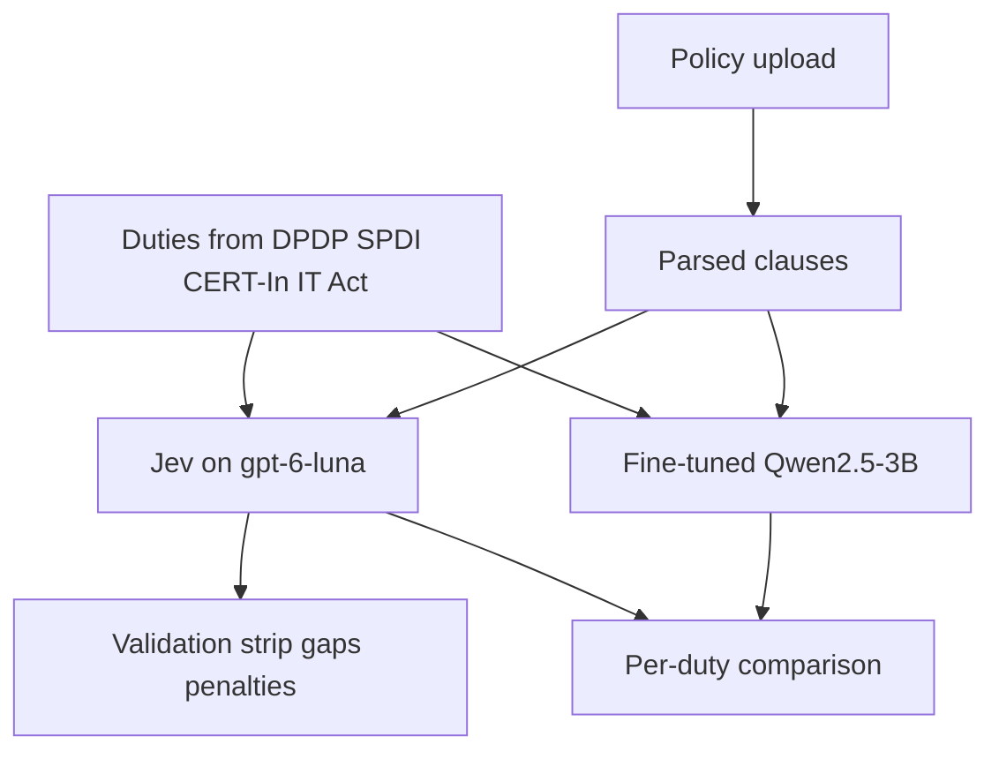

# Jev and Qwen classification

The rules engine stops deciding covered, partial, missing, violation, conflict, and not applicable. [`matching.py`](compliance/src/compliance/matching.py) and [`classify.py`](compliance/src/compliance/classify.py) are no longer called from [`analyze_document`](compliance/src/compliance/service.py).

Two models judge the same question: does this policy meet this duty from the four acts?

- **Jev** is the live score. OpenAI’s Decisions API picks from a fixed answer list and runs on `gpt-6-luna`. The key is `OPENAI_API_KEY` in the environment.
- **Qwen 2.5 3B** is the second score, after it is fine-tuned. It is not the existing `qwen2.5:7b-instruct-q4_K_M` memo model.

The Validation strip, gaps, and penalties read `obligations[].status`, and that field is Jev’s answer. Qwen is stored next to it so the two can be compared. The strip does not average them.

## What analyze does

The duty list still comes from the four catalog graphs. Those graphs are the checklist. The models do not invent new duties.

For each duty, both models receive:

- duty id, act, title, summary, and requirement elements
- the policy’s clauses, with clause ids

They answer with one of `covered`, `partial`, `missing`, `not_applicable`, `undetermined`, `conflict`, `violation`, plus the clause ids they used. Any other string is stored as `undetermined`.

`/analyze` no longer searches Qdrant for duty credits. Queries still use Qdrant. If the OpenAI key is missing or the Luna call fails, `/analyze` returns 503, because there is no rules score to fall back on. Until the Qwen model exists, its column is empty and the strip is Jev only.

Penalties still walk GraphIR `PENALIZES` from the Jev status. That link is not a classifier.

## Luna client

As of 30 Sep 2026 the Decisions API is a limited preview and has no published request schema. Do not invent that body.

- A small client in `compliance/` takes a duty, the clauses, and the allowed statuses, and returns one status plus confidence when the API sends it.
- With a real key, call the preview first. Map the response onto `ObligationStatus`.
- If the preview returns 403, call `gpt-6-luna` chat completions with a strict JSON schema limited to those statuses. Same client, same fields.
- Batch duties when the API accepts more than one question per request.

## How to train Qwen

Train on pairs. Do not train on the 500 policies alone, and do not train on the four acts alone.

The four datasets say what the law requires. A statute is not an example of a company notice being covered or in violation. The 500 Fortune 500 files are the notices under test. They have no status labels. A model trained on either pile by itself learns to continue that text. It does not learn to verify a policy against a duty.

Each training row is:

- the duty, copied from DPDP, SPDI, CERT-In, or the IT Act
- clauses from one company policy
- one status

Jev proposes that status across the saved policies. A person confirms the rows that go into the training file, starting with low-confidence answers. Those confirmed pairs are what Qwen learns. The four acts are inside every row as the duty text, so the model sees the rule it is applying. The policy clauses are the evidence.

The existing files in [`compliance/tests/benchmark/`](compliance/tests/benchmark/) stay out of the training set. They are the test: after training, Qwen and Jev are scored against `gold_pass.json`, `gold_fail.json`, `gold_partial.json`, and `gold_na.json`.

Fine-tune offline on this machine, export the model, and run it through Ollama as `qwen2.5:3b`. The API container does not train. Do not point this column at the 7B memo model.

## Response shape

[`AnalysisResult`](compliance/src/compliance/models.py) keeps `obligations[].status` as the Jev status. Add `qwen_status` on each obligation, or a parallel list with `obligation_id`, `jev_status`, `qwen_status`, and a short reason. Gaps and the coverage strip use the Jev status only.

## Tests

- A fake Jev client sets `obligations[].status`. The strip counts come from that status.
- A fake Qwen client that disagrees does not change the strip.
- An out-of-set answer becomes `undetermined`.
- `analyze_document` does not call `collect_credits` or `classify_duty`.
