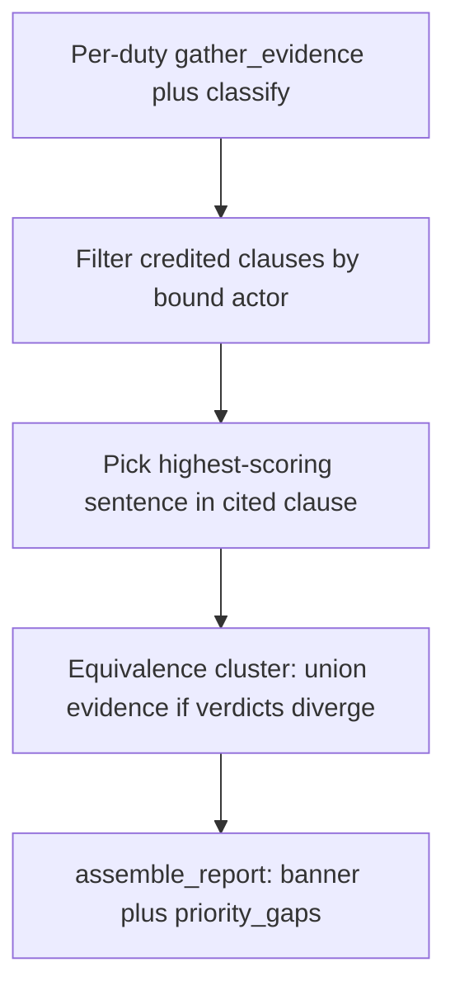

# Fail_Policy audit bugs (verdicts, citations, banner, priority)

Five bugs, one pipeline pass. LLM still does not classify. No spaCy / no embeddings. Do **not** edit catalog roles, elements, or penalty amounts in [`compliance/src/compliance/data/duty_rules.json`](compliance/src/compliance/data/duty_rules.json).

**PASS lock:** BharatPay / `privacy_policy_1.pdf` still has `DPDP_SEC_8_SUB_5` covered or partial (never missing), CA/e-sign N/A, 0 violations.

---

## Bug 1 — Equivalence cluster (grievance)

**Cause:** [`DPDP_SEC_8_SUB_10`](compliance/src/compliance/data/duty_rules.json) has contradiction cues (`does not provide a dedicated privacy grievance…`). [`SPDI_RULE_5_SUB_9`](compliance/src/compliance/data/duty_rules.json) has the same elements and **empty** `contradiction_cues`, so Qdrant can mark it COVERED on an unrelated “Purposes of Processing” hit.

**Do not** “fix” this only by copying cues into `duty_rules.json`. That is a catalog-adjacent edit and misses the general case.

**Fix:** New sidecar [`compliance/src/compliance/data/duty_equivalence.json`](compliance/src/compliance/data/duty_equivalence.json) plus `load_equivalence_clusters()` next to [`load_duty_rules`](compliance/src/compliance/duty_rules.py). First cluster (required):

- `grievance_redressal`: `DPDP_SEC_8_SUB_10`, `SPDI_RULE_5_SUB_9`

Optional second clusters only if they are the same mechanism (not a theme dump): disclosure `SPDI_RULE_6_SUB_1` + `SPDI_RULE_6_SUB_4`; erasure `DPDP_SEC_8_SUB_7` + `DPDP_SEC_8_SUB_8`. Do **not** auto-cluster by embedding.

After the existing loop in [`analyze_document`](compliance/src/compliance/service.py), for each cluster with 2+ **applicable** findings whose statuses diverge:

1. Union credited clauses, contradiction clauses, and **cues** from every rule in the cluster.
2. Re-run `gather_evidence` + `classify_duty` for each member on that shared set.
3. Adverse wins: if the union has a material cue, no member may stay `covered`. Typical result: both grievance duties `violation` (cue, no real positive support).

No new `needs_review` status (would break the 6-bucket banner). If union still diverges after one re-run, keep the more adverse status for all members (`violation` > `conflict` > `missing` > `partial` > `covered`).

**Test (fixture, no Qdrant):** One document with the QuickBazaar §12 denial plus a “Purposes of Processing” paragraph. `DPDP_SEC_8_SUB_10` and `SPDI_RULE_5_SUB_9` both `violation`; both citations contain `dedicated privacy grievance`.

---

## Bugs 2 and 5 — Citation actor + sentence (same pass)

**Cause:** [`gather_evidence`](compliance/src/compliance/matching.py) ranks by Qdrant score and keeps the whole clause. [`_closest`](compliance/src/compliance/pdf.py) and [`policyMap`](web/src/Findings.jsx) / [`closest`](web/src/ReportPanel.jsx) always show `matched_clauses[0]` and **ignore** `counter_evidence` on the PDF. So CONFLICT cites “Accuracy and User Responsibilities” / “parents are responsible…” even when §6 sell/monetise or the advertising sentence is in `counter_evidence`.

**Fix (deterministic, no new NLP library):**

1. **Bound actor** on each `DutyRule` default `fiduciary` (new optional field with default — not a catalog rewrite of roles/elements/penalties). Lexicon in matching:
   - fiduciary: `we`, `our`, `the company`, `body corporate`, `QuickBazaar`, `BharatPay`, `data fiduciary`
   - user: `you`, `your`, `user`, `users are`, `parents are responsible`
   Drop a credited clause if it is user-bound and the duty is fiduciary (e.g. §14 user accuracy vs `SPDI_RULE_6_SUB_1`).
2. If no credited clause remains **and** there is no contradiction → `missing` (do not attach a junk citation to COVERED/CONFLICT/VIOLATION).
3. **Sentence pick:** split `clause_text` on `.!?`; score each sentence by cue overlap first, then element keywords; pick the max. Store that sentence as `MatchedClause.text` (and the same for `counter_evidence`).
4. **Display:** For `violation` / `conflict`, primary citation is the best **counter-evidence** sentence, not `matched_clauses[0]`. Share one `_closest_citation(row)` helper used by PDF, and mirror it in Findings + ReportPanel.

**Tests:**

- `SPDI_RULE_6_SUB_1` with §6 sell/monetise + §14 user-accuracy: citation contains `Sharing` / `sell` / `disclos`; must **not** contain `Accuracy and User Responsibilities` / user-accuracy wording. If only §14 exists → `missing`.
- `DPDP_SEC_9_SUB_3` with both “parents are responsible for supervising” and “advertising, targeted marketing, profiling” in the same section: citation contains `advertising, targeted marketing, profiling`.

---

## Bug 3 — Banner includes Conflict (PDF + web)

**Cause:** PDF counts line in [`render_pdf`](compliance/src/compliance/pdf.py) (lines 75–84) omits `conflict`. Body `scoreboard_sentence` already mentions it. Report UI shows `executive_summary` only — no counts banner.

**Fix:** One formatter, e.g. `counts_banner(counts) -> str`:

`Covered {c} · Partial {p} · Missing {m} · Violation {v} · Conflict {k} · N/A {na}`

- Applicable identity: `covered + partial + missing + undetermined + violation + conflict == total`.
- Catalog: `total + not_applicable == 63`.
- If `undetermined > 0`, append `· Undetermined {u}` (audit; not one of the six named buckets).

Wire into PDF, [`ReportPanel.jsx`](web/src/ReportPanel.jsx) (counts line above the summary), and [`Findings.jsx`](web/src/Findings.jsx) `findings-stat`. [`CoverageStrip.jsx`](web/src/CoverageStrip.jsx) already has a Conflict card; keep Adverse = violation + conflict.

**Test:** Fail-style `ReportCounts` 16/9/2/8/10/18 → banner contains `Conflict 10`; `16+9+2+8+10 == 45`. Update [`test_pdf.py`](compliance/tests/test_pdf.py).

---

## Bug 4 — Priority gaps ranking

**Cause:** [`_priority_gaps`](compliance/src/compliance/report.py) only admits `violation` and **missing-with-penalty**. Partial/conflict never enter. Cap 5. Sort is `(tier, amount, years)` with missing-with-penalty competing oddly vs violation.

**Fix:** Document the formula in a comment on `_priority_gaps`. Candidates = applicable rows with status in `{violation, conflict, missing, partial}`. Sort:

1. Status tier: `violation=4, conflict=3, missing=2, partial=1`
2. `amount_crore` if the penalty row has a figure, else `-1` (violations with an amount still beat any partial)
3. `imprisonment_years` if set, else `-1`
4. Theme frequency: count of other gaps with the same `act` (higher first)

`PRIORITY_GAPS_CAP` stays 5; read optional env `POLARIS_PRIORITY_GAPS_CAP` (default 5).

**Test:** Mix of violation-with-amount (`ITACT_SEC_43A`-style), violation-without-amount, conflict, partial-with-huge-amount. Every violation that has `amount_crore` set ranks above every partial. Update `test_priority_gaps_sorted_and_capped_at_five`.

---

## Regression gold + memo check

- New [`compliance/tests/benchmark/gold_fail_citations.json`](compliance/tests/benchmark/gold_fail_citations.json): per applicable duty `status` (set or small allowed set) + `citation_must_include` / `citation_must_not` for the five acceptance duties; remaining ~40 duties at least `status` so classifier drift is visible.
- Fixture tests (stub search / in-memory clauses) for all five bugs; `@pytest.mark.live` on `Fail_Policy.pdf` for the five acceptance tests (skip if Qdrant/Ollama down).
- After implementation: regenerate Fail_Policy memo/PDF; confirm the five citations/statuses; check previously correct violations (`DPDP_SEC_6_SUB_5`, `_8_SUB_6`, `_8_SUB_10`, `ITACT_SEC_43A`, …) did not flip to covered. `SPDI_RULE_5_SUB_9` **may** flip covered → violation (that is Bug 1).
- `./scripts/graphify.sh update .` after code edits. Dashboard: Version engine; Adverse 8+conflicts among 45.

**Out of scope:** registry/entailment, F1 0.85, changing penalty crore figures, LLM citation scoring.
