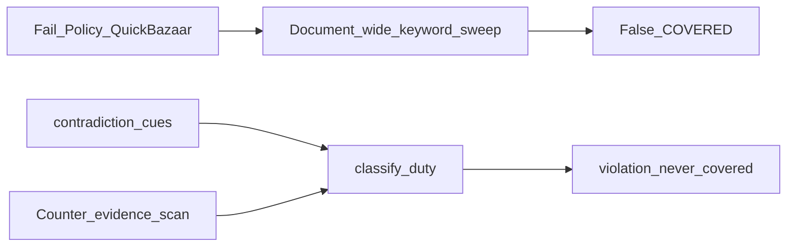

# Fail_Policy Evidence Grounding

I'm using the writing-plans skill. Scope is the **phased** path you chose: no LLM classifier, keep current statuses (`violation` = Remedy `ADVERSE`, `undetermined` = `AMBIGUOUS`). Do not rename the status model.

## What Remedy.md gets right vs wrong

**Right (this is why Fail_Policy is weak):** [`gather_evidence`](compliance/src/compliance/matching.py) walks **every** policy clause for requirement-element keywords (`consent`, `parent`, `breach`, `child`, …). A substring hit marks the element satisfied and can lift quality to MEDIUM/HIGH. [`classify_duty`](compliance/src/compliance/classify.py) then emits `covered` if ≥60% of elements are “satisfied” and quality is HIGH. QuickBazaar says “consent cannot be withdrawn”, “process children’s data without verifiable consent”, “does not provide a dedicated privacy grievance officer”, “users waive all privacy-related rights” — those sentences still contain `consent` / `parent` / `child`, so they **count as coverage**.

**Contradiction detector is almost empty.** [`duty_rules.json`](compliance/src/compliance/data/duty_rules.json) has `contradiction_cues` on only a few duties (`DPDP_SEC_8_SUB_5`, `_8_SUB_6`, `DPDP_SEC_9_SUB_3`). Withdrawal, erasure, grievance, sale, waiver, transfers have **empty** cue lists. Frozen FAIL gold ([`gold_fail.json`](compliance/tests/benchmark/gold_fail.json) + [`FAIL_TEXTS`](compliance/src/compliance/benchmark_cases.py)) is three short denials, not QuickBazaar. Live Fail_Policy therefore never hits the path in `classify_duty` that returns `violation`.

**BharatPay looks “reasonable” for the opposite reason:** the policy has dedicated operative sections (security, children, consent withdrawal). Keyword sweep over-credits (mean ~19 matches/duty) but does not invert the verdict. Do not tighten matching so hard that `DPDP_SEC_8_SUB_5` falls back to missing.

**Wrong or overstated in Remedy.md:**

- **Arithmetic 36+8+1+18 vs 45.** Engine `ReportCounts.total` is **applicable only** ([`_counts`](compliance/src/compliance/report.py)). 36+8+1 = 45 applicable; 18 N/A are extra catalog rows (63). The bug is **presentation**, not `1+1`. Scoreboard must name both denominators and include `violation`/`conflict` in the visible mix. Add `assert_counts_reconcile()` and refuse `/report` if it fails.
- **“N/A because no matching clause.”** Runtime N/A is role/document-type via [`apply_duty`](compliance/src/compliance/applicability.py), not missing evidence. Keep that invariant with a regression test. Do not add `UNKNOWN` in P0.
- **“No duty decomposition.”** Elements exist; they are just keyword-OR over the whole document.
- **8+ / macro-F1 0.85 / entailment / official source URLs / multilingual.** Later. Measure after P0–P1; do not claim 8+ until then.

## Locked decisions

- Keep statuses: `covered | partial | missing | not_applicable | undetermined | conflict | violation`.
- `COVERED` never if any **material** contradiction cue matches anywhere in the policy (counter-evidence), even if other clauses look supportive.
- Element hits only from **credited** clauses (Qdrant credits) plus keyword hits on those same clauses — **not** a full-document sweep. Negative polarity on a clause (`cannot`, `without`, `does not`, `no dedicated`) must not satisfy the element.
- BharatPay regression: `DPDP_SEC_8_SUB_5` stays `covered` or `partial`; CA duties stay N/A; 0 violations on PASS gold.
- LLM still does not classify.

## P0 — Stop false COVERED (Fail_Policy + integrity)

**Files:** [`matching.py`](compliance/src/compliance/matching.py), [`classify.py`](compliance/src/compliance/classify.py), [`duty_rules.json`](compliance/src/compliance/data/duty_rules.json), [`report.py`](compliance/src/compliance/report.py), [`test_matching.py`](compliance/tests/test_matching.py), [`test_classify.py`](compliance/tests/test_classify.py), [`test_report.py`](compliance/tests/test_report.py), [`gold_fail.json`](compliance/tests/benchmark/gold_fail.json), [`benchmark_cases.py`](compliance/src/compliance/benchmark_cases.py).

1. **Polarity-aware element hits.** In `gather_evidence`, drop the `for clause in clauses` document sweep. Score elements only on `credited` clauses (and their `expand_clause_evidence` neighbors). Skip a keyword hit if the clause also matches a small denial lexicon (`cannot`, `without obtaining`, `does not`, `will not`, `no dedicated`, `waive`, `irrevocable`) or the duty’s `contradiction_cues`.
2. **Counter-evidence always.** New helper `find_contradictions(clauses, rule) -> list[Clause]` scanning **all** clauses for `contradiction_cues`. `classify_duty`: if any cue hits, return `violation` (never `covered`). If supportive credited text also exists, `conflict` only when both a cue clause and a **positive** credited clause exist (existing `_has_positive_clause` idea, but cues must not live only in `expanded_texts` of matched hits).
3. **Fill cues** on at least: `DPDP_SEC_6_SUB_5`/`_6` (`cannot be withdrawn`, `irrevocable consent`); `_8_SUB_7`/`_8` (`denied under all circumstances`, `retain indefinitely`, `retain permanently`); `_8_SUB_10` (`does not provide a dedicated privacy grievance`); `DPDP_SEC_9_SUB_1` (`without obtaining verifiable consent`); `_9_SUB_2`/`_3` (child ads / no safeguards); `_16_SUB_1` (unrestricted transfer); `ITACT_SEC_43A` / fiduciary (`no responsibility` for employee/provider breaches); sale/monetise on disclosure duties; rights waiver. Use the exact QuickBazaar phrases extracted from [`Fail_Policy.pdf`](Fail_Policy.pdf).
4. **Arithmetic gate.** `assert_counts_reconcile(counts, catalog_n=63)`: applicable mix (`covered+partial+missing+undetermined+conflict+violation`) == `total`; `total + not_applicable` == catalog_n. Call from `assemble_report`. Scoreboard lists **violations** and says “N of M applicable (K not applicable of 63 catalog duties).”
5. **Tests:** keyword “consent cannot be withdrawn” must **not** satisfy withdrawal elements; full-document “Personal Data means…” must **not** cover `DPDP_SEC_8_SUB_5`; QuickBazaar-style fixture clauses must mark the listed duties `violation`; PASS gold still passes; N/A still requires a role/document reason.

## P1 — Evidence schema + QuickBazaar gold + UI

**Files:** [`models.py`](compliance/src/compliance/models.py), [`explain.py`](compliance/src/compliance/explain.py), [`Findings.jsx`](web/src/Findings.jsx), [`ReportPanel.jsx`](web/src/ReportPanel.jsx), [`CoverageStrip.jsx`](web/src/CoverageStrip.jsx), [`test_benchmark.py`](compliance/tests/test_benchmark.py).

- Per-element result: `supported | contradicted | absent` (not only `satisfied: bool`).
- Findings: show full evidence sentence (not 180-char “closest clause” only) plus counter-evidence snippet for `violation`.
- Coverage strip / priority gaps: **violations first** on Fail_Policy; do not headline “36 covered” when `violation > 0`.
- Expand `FAIL_TEXTS` / `gold_fail.json` with QuickBazaar must-`violation` ids (withdrawal, erasure, grievance, children, waiver). Optional live `pytest -m live` on `Fail_Policy.pdf` when Qdrant is up.
- Re-run BharatPay: coverage may drop from 41/45; **must not** mark `DPDP_SEC_8_SUB_5` missing.

## Later (not this implementation)

Legal-source registry (URL, official citation beyond [`law_versions.json`](compliance/src/compliance/data/law_versions.json)); hybrid entailment; `UNKNOWN` / `CONDITIONALLY_APPLICABLE`; multilingual notice checks; labelled macro-F1 ≥ 0.85. Do not claim 8+ until those are measured.

## Docs

Update [ARCHITECTURE.md](ARCHITECTURE.md) matching/classify paragraph after P0. Do not edit [Remedy.md](Remedy.md).
