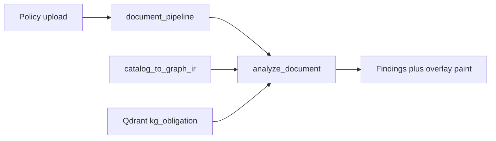

# Hybrid graph + vector fusion

> **For agentic workers:** REQUIRED SUB-SKILL: Use superpowers:subagent-driven-development (recommended) or superpowers:executing-plans to implement this plan task-by-task. Steps use checkbox (`- [x]`) syntax for tracking.

**Goal:** `/analyze` treats GraphIR Obligation nodes as the authoritative duty set and walks `PENALIZES` for penalties; Qdrant only scores those ids. Findings copy names the statute a matched clause satisfies.

**Architecture:** At request time, build the same GraphIR as `semantic-graph from-catalog` via [`catalog_to_graph_ir`](graph_builder/src/graph_builder/catalog_ir.py) (in-process, no Bolt). Iterate Obligation nodes instead of [`LawCatalog.obligations`](compliance/src/compliance/catalog.py). Keep clause → `kg_obligation` search, top-1 hit, 0.55/0.30 thresholds, and title-token gate. Drop any Qdrant id that is not an Obligation node.

**Tech Stack:** Python 3.12, `compliance` + `graph_builder`, existing Qdrant `search_text`, FastAPI `/analyze`, React Findings overlay.

## Global Constraints

- India website-privacy only (`IN` / `INDIA` / `IN-DPDP`). No pluggable jurisdictions.
- No Neo4j at analyze time. Docker `api` still `depends_on: qdrant` only.
- Do not upsert the uploaded policy into Qdrant (ingest-on-analyze stays parked).
- Do not add `applies_if` / `NOT_APPLICABLE` (no structured preconditions on catalog Obligation nodes). Child-under-18 / DPO / consent-manager gating is a later slice.
- Keep `COVERED_SCORE = 0.55`, `PARTIAL_SCORE = 0.30`, title overlap for covered, **top-1 catalog hit per clause** ([`test_only_best_catalog_hit_is_credited`](compliance/tests/test_service.py)).
- `AnalysisResult` stays the UI/report contract. Additive fields only.
- `graph_builder` must not import `compliance`. `compliance` may import `graph_builder`.
- After code edits: `./scripts/graphify.sh update .`

## Why this slice (and what it is not)

Today the JSON catalog already defines scope and Qdrant already cannot introduce unknown ids. The GraphIR lift duplicated that set; `/analyze` still never opens it.

This slice **wires the engine to that graph** so later Cypher or `applies_if` has a real join point. Duty count stays 63 if the four law JSON files are unchanged. Coverage numbers should stay in the same ballpark because scoring rules do not change.

It does **not** implement PRD §15.3 preconditions. “This clause satisfies DPDP §X” here means **attribution** (matched clause ↔ Obligation title/act), not “this duty does not apply because the policy has no children.”

## Files

- **Add** [`compliance/src/compliance/graph_scope.py`](compliance/src/compliance/graph_scope.py) — `ir_from_paths` / `ir_from_catalog`, Obligation iteration, `penalties_for(ir, oid)` via `PENALIZES`.
- **Change** [`compliance/src/compliance/service.py`](compliance/src/compliance/service.py) — build IR, score only Obligation ids, attach penalties from the walk.
- **Change** [`compliance/pyproject.toml`](compliance/pyproject.toml) — depend on `graph-builder`; pytest `pythonpath` includes `../graph_builder/src`.
- **Change** [`docker/api.Dockerfile`](docker/api.Dockerfile) — `COPY graph_builder` and `pip install -e /app/graph_builder`.
- **Change** [`semantic_graph/src/semantic_graph/cli/from_catalog.py`](semantic_graph/src/semantic_graph/cli/from_catalog.py) — call `ir_from_paths` so CLI and engine share one mapper.
- **Tests** [`compliance/tests/test_graph_scope.py`](compliance/tests/test_graph_scope.py) (new) + extend [`compliance/tests/test_service.py`](compliance/tests/test_service.py).
- **UI** [`web/src/Findings.jsx`](web/src/Findings.jsx) — covered/partial copy names act + title.
- **Docs** [`plan.md`](plan.md) Later A checkbox, [`ARCHITECTURE.md`](ARCHITECTURE.md) (engine now imports `graph_builder`; still no Bolt).

## Scoring (locked)

Keep current loop in [`analyze_document`](compliance/src/compliance/service.py):

1. One `search_fn(clause.clause_text)` per policy clause.
2. Keep hits whose `obligation_id` is an Obligation node id.
3. Credit **only** `max(hits, key=score)` for that clause.
4. `_status` unchanged (title tokens for covered).

Do not credit every in-scope hit on a clause (would invert `test_only_best_catalog_hit_is_credited` and move a lot of duties from missing → partial).

## Penalty walk

[`catalog_to_graph_ir`](graph_builder/src/graph_builder/catalog_ir.py) emits `Penalty -PENALIZES-> Obligation`. Engine must use those edges, not `catalog.penalties_for`. Same fixture [`analyze_law.json`](compliance/tests/fixtures/analyze_law.json) must still attach 250 crore to `TINY_SECURE` when missing/partial.

## UI

[`why()`](web/src/Findings.jsx) today says “This policy section covers the duty.” Change to:

- covered: `This clause satisfies {act}: {title}.`
- partial: keep related-but-not-clear; include `{act}: {title}` so the statute is named.
- missing: unchanged.

`paintIdealFromAnalysis` / `paintPolicyFromAnalysis` already key on `obligation_id`. No overlay clustering (Later A “won't do”).

No `/report` or PDF changes unless `AnalysisResult` rows change (they should not, aside from copy).

---

### Task 1: Graph scope helper (TDD)

- [x] **Write failing tests** in `compliance/tests/test_graph_scope.py`:
  - `ir_from_paths` on `analyze_law.json` yields Obligation ids `TINY_CONSENT`, `TINY_SECURE` (not `TINY_GOVERNANCE`, not `DOC_TINY`).
  - `PENALIZES` from `TINY_PENALTY_SEC` to `TINY_SECURE`.
  - `penalties_for(ir, "TINY_SECURE")` has `amount_crore == 250`; `penalties_for(ir, "TINY_CONSENT")` is empty.
- [x] Run tests; confirm they fail (module missing).
- [x] **Implement** `graph_scope.py`: map `LawCatalog` → `CatalogObligation` / `CatalogPenalty` (same fields as [`from_catalog.py` lines 63–86](semantic_graph/src/semantic_graph/cli/from_catalog.py)), call `catalog_to_graph_ir`.
- [x] Run tests; confirm pass.
- [x] Point `catalog_to_ir_from_paths` at `ir_from_paths` so CLI and engine cannot drift.
- [x] Run `semantic_graph/tests/test_export_cli.py` from-catalog tests.

### Task 2: Rewire `analyze_document` (TDD)

- [x] **Add failing tests** in `test_service.py`:
  - Search returns a high-score hit whose id is **not** an Obligation node (`NOT_IN_GRAPH`); that id must not appear in `result.obligations`.
  - Existing tests still pass, including top-1 and penalty on `TINY_SECURE`.
- [x] Change `analyze_document` to:
  - `ir = ir_from_paths(law_paths)`
  - `best` keyed by Obligation node ids
  - Display fields from node `properties` (`title`, `summary`, `act`, `text`)
  - Penalties from `penalties_for(ir, oid)` for non-covered rows
- [x] Keep `default_search` / `AnalyzeError` / jurisdiction checks as they are.
- [x] Run `pytest compliance/tests/test_service.py compliance/tests/test_graph_scope.py`.

### Task 3: Package + Docker

- [x] Add `graph-builder` to compliance `dependencies`; extend pytest `pythonpath`.
- [x] Dockerfile: copy `graph_builder/` and `pip install -e /app/graph_builder`.
- [x] Rebuild is enough to verify import; no compose `depends_on: neo4j`.

### Task 4: Findings copy

- [x] Update `why()` in Findings as specified. No new API fields required (`act` and `title` already exist on `ObligationFinding`).
- [x] Rebuild `web` Docker image and click a covered row: copy names the act and duty title; overlay still focuses the matching law_chunk + policy section.

### Task 5: Docs + graphify

- [x] Tick Later A **Hybrid graph+vector fusion** in [`plan.md`](plan.md). Note: GraphIR in-process; Neo4j Cypher still later; `applies_if` still later.
- [x] [`ARCHITECTURE.md`](ARCHITECTURE.md): `/analyze` builds GraphIR from law JSON; Qdrant scores; Neo4j optional and unused on this path. Remove the old “compliance does not import graph_builder” claim (Phase 4 plan is historical).
- [x] `./scripts/graphify.sh update .`

## Out of scope

- Live Cypher / `api` `depends_on: neo4j` / 503 if Bolt down
- `dump-ir --enrich` ids (`obl_<clause>_n`) as analyze source
- Obligation-first or multi-hit scoring
- Overlay folder clustering / `KEPT_TOPICS`
- Report Later B (engine themes, scoreboard, PDF filename)
- Cloud chat

## Verification

- `pytest` on compliance graph_scope + service (+ from-catalog CLI tests if mapper moved)
- Docker `api` import: `from compliance.graph_scope import ir_from_paths` succeeds
- One real `/analyze` against the four law files: still 63 obligation rows; penalties still only on gaps; Qdrant/Ollama 503 path unchanged
