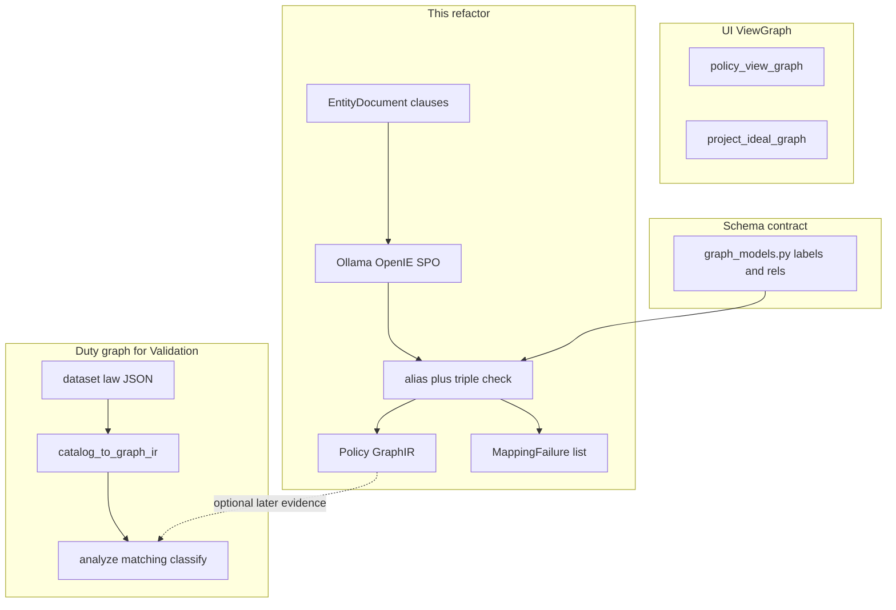

# Ideal-Graph-Constrained OpenIE (optimized)

> **For agentic workers:** Use superpowers:subagent-driven-development or executing-plans. Repo copy: [`.cursor/plans/openie-graphir-constrained.plan.md`](.cursor/plans/openie-graphir-constrained.plan.md). Cursor preview stays under `~/.cursor/plans/`.

**Goal:** Policy text becomes GraphIR only after OpenIE-style SPO extraction is mapped onto the existing allowed labels/relations; unmapped triples are kept as failures, never as new vocabulary.

**Architecture:** Keep three graphs distinct. **Schema** = [`graph_builder/src/graph_builder/graph_models.py`](graph_builder/src/graph_builder/graph_models.py). **Duty universe** for covered/partial/missing = [`catalog_to_graph_ir()`](graph_builder/src/graph_builder/catalog_ir.py) from `dataset/*_graph.json`. **UI trees** = [`project_ideal_graph`](policy_compare/src/policy_compare/projection.py) / [`policy_view_graph`](policy_compare/src/policy_compare/policy_view.py). OpenIE feeds only the first. `/analyze` stays clause → Qdrant → [`matching.py`](compliance/src/compliance/matching.py) → [`classify.py`](compliance/src/compliance/classify.py).

**Tech stack:** Existing Ollama/Qwen (`LLMClient` in [`llm_graph_builder.py`](graph_builder/src/graph_builder/llm_graph_builder.py)), GraphIR, GraphValidator, document_pipeline clauses. No Stanford OpenIE, no Redis, no new ontology JSON that duplicates labels.

## Why the original spec is too large

The draft treats “Ideal Graph” as one object. This repo has three:

Original spec also asked to replace comparison, GraphRAG, Louvain, RRF, and the frontend. Those already work on **duties and ViewGraphs**, not on `COLLECTS` edges. Wiring them in this pass would break Validation.

**Cut from v1:** Stanford OpenIE; a parallel ontology file with invented `Organization`/`USES_FOR` names; rewriting [`matching.py`](compliance/src/compliance/matching.py); web/; GraphRAG; Neo4j load as a requirement; replacing document_pipeline chunking/NER.

**Keep:** document_pipeline as chunker; [`GraphIR`](graph_builder/src/graph_builder/graph_ir.py); [`GraphValidator`](graph_builder/src/graph_builder/graph_validator.py) (extend, do not replace); [`LLMGraphBuilder`](graph_builder/src/graph_builder/llm_graph_builder.py) for replay tests; catalog GraphIR untouched so a policy upload cannot add duties.

## Source of truth (do not duplicate)

Reuse [`ALLOWED_NODE_LABELS`](graph_builder/src/graph_builder/graph_models.py) and [`ALLOWED_RELATIONSHIP_TYPES`](graph_builder/src/graph_builder/graph_models.py) (`PersonalData`, `COLLECTS`, `SHARES`, `RETAINS`, `USES`, `PROCESSES`, `Obligation`, `PENALIZES`, …). Add **one** missing piece the current validator does not have: allowed **triples** `(source_label, rel, target_label)`.

Derive triples from those labels, not from the spec’s sample JSON. Example (final table is code, reviewed by a human): `Entity|Actor --COLLECTS--> PersonalData|SensitiveData`. Reject `OWNS` because it is not in `ALLOWED_RELATIONSHIP_TYPES`.

Catalog already emits `RequirementElement` / `HAS_REQUIREMENT` which are **not** in `graph_models.py`. Do not silently “fix” that in this plan except if a test forces validator onto catalog IR; if so, add those two names to the allowed sets rather than inventing a second schema.

## Implementation map (reuse)

| Layer | Today | Change |
|---|---|---|
| PDF → clauses | `document_pipeline` | None |
| Policy UI graph | `policy_view_graph` | None |
| Law UI graph | `project_ideal_graph` | None |
| Duty scoring | `collect_credits` + classify | None in v1 |
| Policy GraphIR | `LLMGraphBuilder` emits GraphIR in one Qwen call | Replace **that emission** with SPO → normalize |
| Validate | label/rel membership, dangling ids | Add triples; policy path **collects** failures instead of only raising |
| Neo4j / Cypher | `GraphBuilderPipeline` | Unchanged after IR exists |

## Phase 2 — Extraction (Ollama SPO only)

Create [`graph_builder/src/graph_builder/propositions.py`](graph_builder/src/graph_builder/propositions.py): `RawProposition(subject, predicate, object, evidence, source_clause_id, document_id, confidence, section_title)`.

Create [`graph_builder/src/graph_builder/openie.py`](graph_builder/src/graph_builder/openie.py): `OpenIEExtractor` using the existing `LLMClient` protocol. Prompt returns **only** `{ "propositions": [ { subject, predicate, object, evidence, clause_id } ] }`. Never node labels or rel types. Parse into `RawProposition[]`. Empty/invalid JSON → error, not invented triples.

Input is already-chunked [`EntityDocument`](document_pipeline/src/document_pipeline/models/entity.py) clauses (same user prompt payload as [`serialize_entity_document`](graph_builder/src/graph_builder/graph_prompt.py)). Batch clauses in the user prompt; do not add Redis.

Tests: fixture clause “We collect your email address to provide services.” → one proposition with predicate containing collect, object containing email, evidence = sentence.

## Phase 3 — Canonical mapping

Create [`graph_builder/src/graph_builder/ontology.py`](graph_builder/src/graph_builder/ontology.py): `ALLOWED_TRIPLES: frozenset[tuple[str, str, str]]` plus loaders for alias files:

- Create [`graph_builder/src/graph_builder/data/relation_aliases.json`](graph_builder/src/graph_builder/data/relation_aliases.json) — `collect|gathers|obtain` → `COLLECTS`; do **not** collapse `shares`/`sells`/`discloses` unless a later legal review says so (start: `shares`/`discloses` → `SHARES`, `sells` → unmapped until reviewed).
- Create [`graph_builder/src/graph_builder/data/entity_aliases.json`](graph_builder/src/graph_builder/data/entity_aliases.json) — `email|email address` → canonical name `email_address` with label `PersonalData`.

Create [`graph_builder/src/graph_builder/normalize.py`](graph_builder/src/graph_builder/normalize.py):

- `normalize_entity(raw) -> CanonicalEntity | Ambiguous | Unmapped`
- `normalize_relation(raw, src_label, tgt_label) -> str | None`
- Order: exact canonical → alias → optional embedding **suggestion only** (if `nomic` is up); never auto-accept on cosine alone.
- Context: extra OpenIE triples on the same clause become GraphIR **properties** on the edge (`purpose`, `duration`) when the alias table says so; otherwise stay in `MappingFailure.metadata`.

Create [`graph_builder/src/graph_builder/mapping_failures.py`](graph_builder/src/graph_builder/mapping_failures.py): statuses `UNMAPPED_ENTITY`, `UNMAPPED_RELATION`, `AMBIGUOUS_ENTITY`, `AMBIGUOUS_RELATION`, `INVALID_RELATION_COMBINATION` with raw SPO, clause id, evidence, reason.

Create [`graph_builder/src/graph_builder/policy_graph_builder.py`](graph_builder/src/graph_builder/policy_graph_builder.py): `build(entity_document) -> tuple[GraphIR, list[MappingFailure]]`. Merge duplicate canonical nodes. Set `source_clause` on nodes. Policy upload must not write catalog JSON or `graph_models` allowed sets.

Keep [`LLMGraphBuilder.build`](graph_builder/src/graph_builder/llm_graph_builder.py) for existing tests; pipeline gains an optional `policy_builder` path so Neo4j still receives **validated GraphIR only**.

## Phase 4 — Validation

Extend [`GraphValidator`](graph_builder/src/graph_builder/graph_validator.py):

- Existing hard checks stay for Neo4j/Cypher (`validate` still raises).
- Add `validate_policy(graph_ir) -> list[str]` **or** validate triples inside `policy_graph_builder` before nodes/edges are appended: if rel not allowed or `(src, rel, tgt)` not in `ALLOWED_TRIPLES`, do not emit the edge; append `INVALID_RELATION_COMBINATION`.
- Do not add `OWNS`. Do not add node types from OpenIE.

Extend [`GraphIR`](graph_builder/src/graph_builder/graph_ir.py) only if needed: optional `evidence` list on relationships (clause id + sentence). Prefer `properties["evidence"]` / `properties["clause_id"]` to avoid breaking `from_dict` callers.

## Phase 5 — Integration (narrow)

Do **not** change covered/partial/missing math.

Optional, only after Phase 4 tests pass: [`analyze_document`](compliance/src/compliance/service.py) may attach `policy_graph_ir` + `mapping_failures` on [`AnalysisResult`](compliance/src/compliance/models.py) as unused-by-scoreboard fields (or a sidecar on the API response). Matching still uses Qdrant credits. Frontend unchanged.

GraphRAG, RRF, Louvain, Sugiyama: no edits.

## Phase 6 — Tests (must actually run)

New:

- `graph_builder/tests/test_openie.py` — parse SPO JSON; reject GraphIR-shaped model output
- `graph_builder/tests/test_normalize.py` — `gathers` → `COLLECTS`; `email` → `PersonalData`; `owns` → unmapped
- `graph_builder/tests/test_policy_graph_builder.py` — final IR labels/rels ⊆ allowed sets; every node has `source_clause` or document-level id; failures retained
- Validator: invalid triple rejected

Regression:

- `pytest graph_builder/tests` and `pytest compliance/tests/test_matching.py compliance/tests/test_classify.py` — statuses unchanged

## Constraints (copied from spec)

- Policy cannot invent Ideal vocabulary.
- Embeddings are not the sole authority for legal rel mapping.
- Unmapped is stored, not dropped.
- Local Ollama only for SPO.

## Manual / legal review (do not hide)

Alias rows for `sells` vs `SHARES`, `licenses`, `transfers` (cross-border), and any cosine-only entity match. Those stay `UNMAPPED` until a person edits the JSON aliases.
