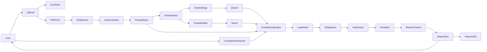
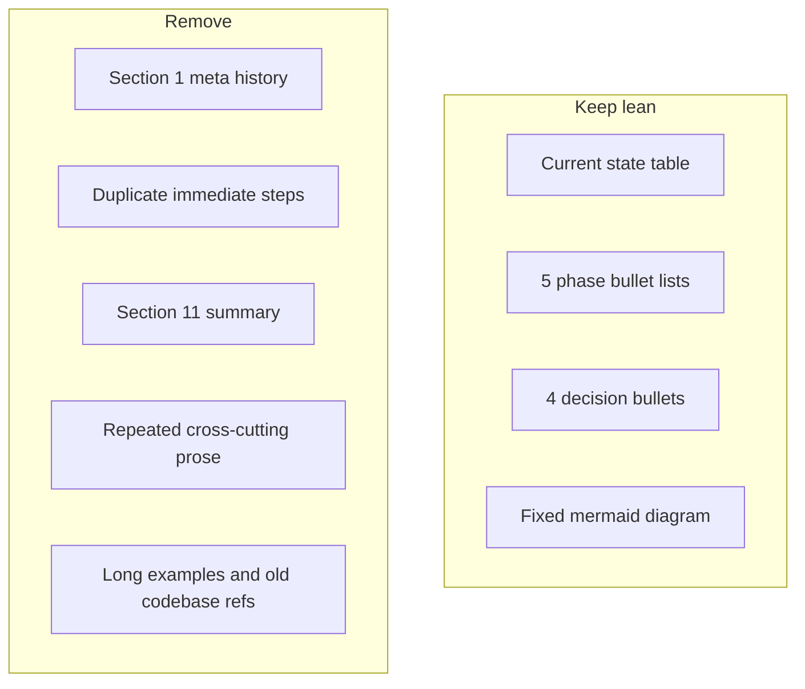

# Optimize PolarisLex plan.md

## What to remove from the current plan

| Section | Why remove or merge |
|---|---|
| **§1 "What changed since the last plan"** | Meta-commentary about Sonnet/old `PolarisMain`; not actionable. Keep at most one line on the GitHub benchmark (18/28 headings) under testing. |
| **§4 Immediate next steps** | Duplicates §5 Phase A almost verbatim — merge into one Phase 1 section. |
| **§11 Suggested build order** | Third copy of the same ordering — delete entirely. |
| **§10 Cross-cutting concerns** | Mostly repeats items already in phases. Collapse to a short **Decisions** block (4 bullets). |
| **Verbose Phase C/D prose** | "Settled approach from earlier discussion", long jurisdiction notes, California sub-heading examples — trim to bullets. |
| **Old PolarisMain / FastAPI references** | Not needed for forward work unless API is in scope; defer to Phase 4 as one bullet. |
| **Broken architecture diagram** | Current block is plain text labeled `flowchart LR`, not valid Mermaid. Replace with a proper diagram. |

## Factual corrections (verified against codebase)

These must be fixed in the rewritten plan — the current plan overstates readiness in a few places:

1. **`LLMPreparer` is abstract only** — no concrete implementation exists in [`document_pipeline/src/document_pipeline/pipeline/stages/llm_preparer.py`](document_pipeline/src/document_pipeline/pipeline/stages/llm_preparer.py). The orchestrator cannot run end-to-end today.
2. **CLI bypasses the orchestrator** — [`document_pipeline/src/document_pipeline/cli/preview.py`](document_pipeline/src/document_pipeline/cli/preview.py) manually wires stages and stops at `clause_extractor`; it never calls `DocumentPipelineOrchestrator` or the three unwired stages.
3. **Correct wiring order for unwired stages** (by input/output types):
   ```
   clause_extractor → document_understanding → context_builder → entity_extractor
   ```
   `LLMPreparer` currently accepts `SegmentedDocument`; it should be repositioned or updated to accept `EntityDocument` so chunks include classification, references, and entities.
4. **README is stale** — [`document_pipeline/README.md`](document_pipeline/README.md) still says "Architecture skeleton only"; stages 1–4 are implemented with **188 tests** (verified by grep across `tests/`).
5. **Stage numbering is inconsistent** in code comments (e.g. `document_understanding` = "Stage 5" while `clause_builder` is also called Stage 5 in tests). The optimized plan should use **stage names**, not numbers, to avoid confusion with the 15-step product diagram.

## Optimized plan structure (~70 lines target)

### Header + architecture (short)

- One-paragraph goal: `document_pipeline/` is the preprocessing layer; downstream is compliance analysis.
- Valid Mermaid diagram for the 15-step product flow (same topology as today, fixed syntax):



### Current state (one table + three bullets)

**Wired and tested:** loader, cleaner, section_extractor, block_extractor, clause_builder, clause_extractor.

**Built and tested, not wired:** `document_understanding`, `context_builder`, `entity_extractor`.

**Gaps:** abstract `LLMPreparer`; orchestrator unused by CLI; no HTML parser (`.txt/.pdf/.docx` only); no persistence beyond `output/DOC_*.json`; no LLM/API/DB.

Key file references:
- Orchestrator: [`document_pipeline/src/document_pipeline/pipeline/orchestrator.py`](document_pipeline/src/document_pipeline/pipeline/orchestrator.py)
- Heading fix: [`document_pipeline/src/document_pipeline/sectioning/heading_detector.py`](document_pipeline/src/document_pipeline/sectioning/heading_detector.py) (`STANDALONE` heuristic)
- Entity dict (DPDP-biased): [`document_pipeline/src/document_pipeline/pipeline/stages/entity_extractor.py`](document_pipeline/src/document_pipeline/pipeline/stages/entity_extractor.py)

### Phase 1 — Complete document intelligence (immediate)

- Wire `document_understanding` → `context_builder` → `entity_extractor` into orchestrator after `clause_extractor`.
- Implement concrete `LLMPreparer`; decide whether it runs after entity extraction (recommended) and update return type accordingly.
- Unify CLI `preview` with orchestrator; extend `PipelinePreviewArtifact` to include classifications, references, and entities.
- Add real-policy fixture library (5–10 docs including Snap/GitHub-style policies); use as regression suite for heading/sectioning.
- Patch `heading_detector` gaps found by fixtures (target: improve on ~18/28 benchmark).
- **Decision:** entity extraction strategy — extend dictionary/regex vs. LLM swap-in via existing `ClassifierFn` / detector interface.
- Add D1/D2 persistence (SQLite to start); replace one-off JSON preview as the canonical parsed store.
- Add HTML parser only if needed for scraped policies (`DocumentFormat.HTML` already exists in metadata).
- Update README status section.

### Phase 2 — Embeddings + Qdrant

- Finalize Phase 1 entity strategy.
- Embed at clause level (`ContextualClause` / `EntityClause`).
- Default to local embedding model (privacy-sensitive docs).
- Stand up Qdrant locally (`docker run … qdrant/qdrant`).

### Phase 3 — Policy graph + Neo4j

- Define versioned graph schema first (nodes: `Clause`, `Party`, `Obligation`, `DefinedTerm`; edges: `OBLIGATES`, `REFERENCES`, `DEFINED_IN`). Map from existing `Reference` model in [`document_pipeline/src/document_pipeline/models/context.py`](document_pipeline/src/document_pipeline/models/context.py).
- LLM (if used) outputs schema-validated JSON only; Python owns all `MERGE` writes.
- Stand up Neo4j locally; add idempotency tests (re-ingest same doc → no duplicates).

### Phase 4 — Compliance engine (Steps 8–14)

- API entry point: document ID + optional jurisdiction → trigger analysis.
- Orchestrator pulls parsed store, Qdrant, Neo4j.
- Steps: applicable law → obligations → missing clauses → penalties → **compliance context** (rename away from structural `context_builder.py` — e.g. `compliance_context_builder.py`).
- **Decision:** jurisdiction scope (current entity dict is DPDP/India-biased; confirm single-framework MVP vs. pluggable jurisdictions).

### Phase 5 — Report generation + Reports DB

- LLM report from structured compliance context (not free-form).
- Fixed report sections mirror Steps 10–13.
- Persist reports keyed by document ID + analysis run.

### Decisions (apply once, reference from phases)

- **Privacy posture** before Phase 2: self-hosted vs. third-party LLM/embeddings.
- **Naming:** structural `ContextBuilder` vs. compliance-level context builder — resolve before Phase 4.
- **Schema discipline:** all LLM stages validate against pydantic models before downstream use (pattern already in `ClassificationResult`, `Entity`, `Reference`).

## What stays vs. what goes (summary)



## Implementation note

After approval, replace the contents of [`plan.md`](plan.md) with the optimized structure above (~70 lines). No code changes in this step — documentation only. Optionally add a one-line note that [`document_pipeline/README.md`](document_pipeline/README.md) should be updated in Phase 1 (not duplicated in full in plan.md).
