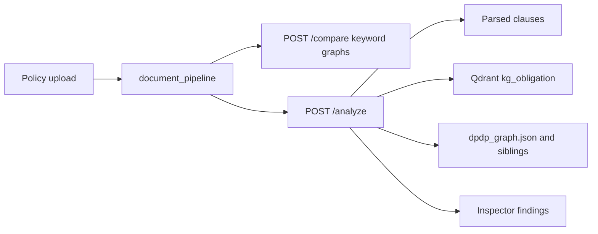

# Phase 4 compliance engine (India MVP)

## Locked decisions

- **Jurisdiction:** single-framework MVP — India website privacy (DPDP + existing SPDI / CERT-In / IT Act overlap). Not pluggable plugins.
- **Surface:** `POST /analyze` plus findings in the existing Validation **Comparison Details** inspector. No new product page. Overlay `/compare` stays keyword graphs.
- **Naming:** pipeline `ContextBuilder` is document structure only. Engine output is `AnalysisResult` (findings). Never call it “context.”
- **Parked:** smarter overlay matching, Spec 4, Phase 5 LLM reports / reports DB, Neo4j obligation traversal (`dump-ir` still has no `Obligation` nodes).

## Why not Neo4j in v1

`semantic-graph dump-ir` writes Document/Section/Clause only. Obligations live in the overlay law files (`chunk_type: obligation`) and in Qdrant as `kg_obligation` (from the live ingest into `kg_export/`). v1 uses those two stores. Neo4j join is a later Phase 4 increment after LLM GraphBuilder/enrichment.

## Architecture

New package [`compliance/`](compliance/) (does not import `graph_builder`). [`policy_compare`](policy_compare/) stays the overlay + FastAPI host.

**Pipeline (`analyze_document`):**

1. **Applicable law** — `jurisdiction` default `IN`. Catalog = `load_law_chunks` keep-set, filtered to `chunk_type` in `{obligation, duty, compliance_requirement}` (website-privacy topics already applied).
2. **Match** — for each policy clause (from `entity_clauses` / clauses), `vectorization.search_text(clause_text, source_type="kg_obligation")`. Map hits to catalog ids via `payload.obligation_id` / `law_code`. Score ≥ existing `VECTORIZATION_SEARCH_MIN_SCORE` (0.55) = covered; else if any hit ≥ 0.30 = partial. Catalog rows with no hit = missing.
3. **Penalties** — from raw law JSON `node_properties.penalty_amount_crore` / `imprisonment_years` and `chunk_type == penalty`. Attach to missing (and partial) obligations when `PENALISES` / `CITES` points at that `doc_id`, or when the obligation row itself has a penalty amount.
4. **Return** pydantic `AnalysisResult`: `document_id`, `jurisdiction`, `applicable_laws[]`, `obligations[]` (`status`: covered | partial | missing), `gaps[]` (missing/partial only), `penalties[]`.

Do **not** upsert the uploaded policy into Qdrant in v1 (avoids mutating the shared index on every UI click). Query embedding happens per clause via existing `search_text`.

If Qdrant or Ollama is down: `503` with a short message. `/compare` still works.

## API

Add to [`policy_compare/src/policy_compare/api.py`](policy_compare/src/policy_compare/api.py) (same upload rules as `/compare`):

`POST /analyze` multipart `file` + optional form `jurisdiction` (default `IN`).

Reuse parse/temp-file logic; extract a small `_parse_upload` helper so compare and analyze do not drift.

Install `vectorization` on the API image ([`docker/api.Dockerfile`](docker/api.Dockerfile)). Compose: `api` `depends_on: qdrant`, `VECTORIZATION_QDRANT_URL=http://qdrant:6333`, Ollama `http://host.docker.internal:11434/api/embeddings` (document that Ollama must run on the host).

## UI

[`web/src/App.jsx`](web/src/App.jsx): after a successful `/compare`, `POST /analyze` with the same `FormData`. Store `analysis` state. Failure of analyze must not clear the graphs.

[`web/src/Inspector.jsx`](web/src/Inspector.jsx): when no node is selected (or always above node details), show **Analysis**: applicable laws, counts, gap list (title + status), penalty lines. Keep existing node-inspect behavior.

No change to [`matcher.py`](policy_compare/src/policy_compare/matcher.py) / topic keywords.

## Tests (TDD)

- Fake `search_text` / embedder: covered vs missing obligations, penalty attach, empty catalog.
- API test: mock analyzer, `503` when search raises connection error.
- Inspector: if there is no frontend test harness, verify via pytest for API only and a manual/browser pass for the panel.

## Docs

Tick Phase 4 API / pull / steps in [`plan.md`](plan.md) as v1 (note Neo4j still later). One paragraph in [`ARCHITECTURE.md`](ARCHITECTURE.md): `/analyze` vs `/compare`, Ollama+Qdrant required for analyze only.

## Out of scope

Pluggable jurisdictions, document-id lookup of stored `DOC_*.json`, ingest-on-analyze, overlay embedding match, LLM reports, Neo4j Cypher traversal.
