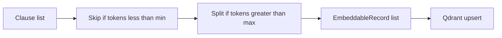

# Spec 2 — Ingest quality implementation

Implement [`.cursor/plans/vector_ingest_quality.plan.md`](.cursor/plans/vector_ingest_quality.plan.md) only. Spec 6 is written ([`vector_kg_ingest.plan.md`](.cursor/plans/vector_kg_ingest.plan.md)) but **not implemented here**. Specs 3–5 and 7 wait. TDD, no live Qdrant/Ollama. Do not commit unless asked.

## Files

- Create [`vectorization/src/vectorization/chunking.py`](vectorization/src/vectorization/chunking.py) — `token_count`, sentence/token split, `clauses_to_embeddable`
- Modify [`vectorization/src/vectorization/models.py`](vectorization/src/vectorization/models.py) — `clause_to_embeddable` still joins title + text; put `chunk_index` in `source` (default 0). Keep embedding `chunk_text` via an optional argument so split records reuse the same join.
- Modify [`vectorization/src/vectorization/store.py`](vectorization/src/vectorization/store.py) — `point_id(document_id, clause_id, chunk_index=0)` hashes `document_clause:{document_id}:{clause_id}:{chunk_index}` (namespace prefix so Spec 6 KG ids cannot collide); upsert uses `record.source.get("chunk_index", 0)` and writes `chunk_index` on the payload
- Modify [`vectorization/src/vectorization/pipeline.py`](vectorization/src/vectorization/pipeline.py) — `run()` uses `clauses_to_embeddable` and logs skipped count
- Modify [`vectorization/src/vectorization/config/settings.py`](vectorization/src/vectorization/config/settings.py), [`.env.example`](vectorization/.env.example), [`README.md`](vectorization/README.md)
- Tests: [`vectorization/tests/test_models.py`](vectorization/tests/test_models.py) (or new `test_chunking.py`) + [`vectorization/tests/test_store.py`](vectorization/tests/test_store.py)

Keep `clause_to_embeddable` for store tests and unsplit clauses. Skip/split live in `clauses_to_embeddable`.

## Chunking rules

Whitespace tokens on **`clause_text` only** (section title does not affect skip). Defaults: min 5, max 512, overlap 50.

- `token_count(text) = len(text.split())`
- Below min: omit (not upserted)
- At or below max: one record, `chunk_index=0`, `retrieval_text` = `section_title — clause_text` (same as today)
- Above max: split on `(?<=[.!?])\s+`. Pack sentences into chunks ≤ max tokens. Next chunk is prefixed with the last `overlap` tokens of the previous chunk’s text. If a single sentence exceeds max, hard-split that sentence by token windows so every chunk is still ≤ max.
- Split records: same `clause_id` / full original `clause_text` in payload; `retrieval_text` joins title with **chunk** text; `source["chunk_index"]` starts at 0

`point_id` becomes UUID5 of `document_clause:{document_id}:{clause_id}:{chunk_index}`. Two-arg calls keep working (`chunk_index=0`). Existing live points will not match; README must say delete collection / `docker compose down -v` and re-ingest. No dual-id layer. The `document_clause:` prefix is so Spec 6 can use `kg_obligation:` / `kg_section:` keys in the same collection.

## Tests first

- 3-token clause skipped; 5-token kept; long section title does not save a 3-token body
- 600-token clause (repeated word) → ≥2 records, same `clause_id`, distinct `chunk_index`, each chunk body ≤ 512 tokens
- Second chunk starts with the last 50 tokens of the first
- `point_id(doc, clause, 0) != point_id(doc, clause, 1)` and is stable
- Upsert payload includes `chunk_index`; point id uses it
- Existing join + search tests still pass

Run: `cd vectorization && ../.venv/bin/pytest -q`

## Docs

Settings: `VECTORIZATION_MIN_CLAUSE_TOKENS=5`, `MAX=512`, `CHUNK_OVERLAP_TOKENS=50`. README: skip/split behavior, `chunk_index` in point id, recreate-collection note after this change.
