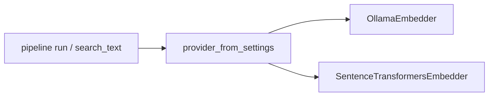

# Spec 3 — EmbeddingProvider

**Depends on:** Spec 1 (done). Prefer Spec 2 first if both are in flight (`embed_batch` helps long split lists). **Does not wait on:** retrieval_text, richer inputs, KG.

PRD §14.3: Sentence Transformers `all-mpnet-base-v2` (768-d) as default, swappable via an `EmbeddingProvider` interface, batched (default 32). This project already chose **local Ollama `nomic-embed-text`** for privacy. Do not silently switch the default.

Today [OllamaEmbedder](vectorization/src/vectorization/embedder.py) is a concrete class. The docstring already says it exists so the backend can be swapped. [pipeline.py](vectorization/src/vectorization/pipeline.py) and `search_text` instantiate it directly. There is no `embed_batch`; ingest is one HTTP call per clause.



## Protocol

In [vectorization/src/vectorization/embedder.py](vectorization/src/vectorization/embedder.py) (or `providers.py`):

```python
class EmbeddingProvider(Protocol):
  def embed(self, text: str) -> list[float]: ...
  def embed_batch(self, texts: list[str]) -> list[list[float]]: ...
  def close(self) -> None: ...
```

Context-manager `__enter__` / `__exit__` calling `close` on both implementations (same as today).

Keep `EmbeddingError`. Dim mismatch: embedder may log; **store still raises** `ValueError` on upsert/search (already implemented). Do not change that split of responsibility.

## Ollama (default)

`OllamaEmbedder` implements the protocol. `embed` stays a POST to `VECTORIZATION_OLLAMA_URL` with `{"model", "prompt"}`.

`embed_batch`: sequential `embed` calls (Ollama’s embeddings API is one prompt per request). Preserve order. Empty list → empty list.

Do not add a second HTTP client.

## Sentence Transformers (optional)

`SentenceTransformersEmbedder`:

- Load `sentence_transformers.SentenceTransformer(settings.embedding_model)`
- Default model name when backend is `sentence_transformers`: `all-mpnet-base-v2` (still 768-d)
- `embed_batch` uses `model.encode(texts, batch_size=settings.embed_batch_size, normalize_embeddings=False)` then `tolist()`. L2-normalize remains in the store.
- `embed` is `embed_batch([text])[0]`
- Extra: `sentence-transformers` in `[project.optional-dependencies]` as `st` (or `embed`). Core `pip install -e .` must not require it.
- ImportError with a clear message if backend is `sentence_transformers` but the extra is missing.

## Factory + settings

```python
def provider_from_settings(settings: VectorizationSettings) -> EmbeddingProvider:
```

- `VECTORIZATION_EMBEDDING_BACKEND` = `ollama` (default) | `sentence_transformers`
- When backend is `sentence_transformers` and `embedding_model` is still the ollama default `nomic-embed-text`, use `all-mpnet-base-v2` unless the user set `VECTORIZATION_EMBEDDING_MODEL` explicitly. Simplest rule that cannot mix dims: **if backend is `sentence_transformers`, default `embedding_model` to `all-mpnet-base-v2`**. Document that switching backend requires a re-embed (Spec 7) and a matching `VECTORIZATION_EMBEDDING_DIM` (both 768 today).
- `VECTORIZATION_EMBED_BATCH_SIZE` default `32` (PRD). Pipeline ingest: call `embed_batch` on slices of `settings.embed_batch_size` (or reuse `batch_size` — pick **one**: use `embed_batch_size` for model encode, keep `batch_size` for Qdrant upsert). Default both 32 and 50 is fine; do not conflate them.

Pipeline and `search_text` use `provider_from_settings`, not `OllamaEmbedder(...)`.

`embedding_model_version` in Qdrant payload stays `settings.embedding_model` (the model id string). Search already filters on it.

## Tests (TDD)

Mock HTTP for Ollama (no live Ollama):

- `embed_batch(["a", "b"])` calls embed twice, returns two vectors, order preserved
- factory `backend=ollama` returns `OllamaEmbedder`

Sentence Transformers tests mock `SentenceTransformer.encode` (do not download weights in CI):

- factory `backend=sentence_transformers` calls encode with the given texts
- missing extra raises a message containing `sentence-transformers`

Wrong dim still raises in `VectorStore.upsert_batch` / `search` (existing tests).

## Out of scope

- Changing the default off Ollama
- Re-embed migration CLI (Spec 7)
- Domain-tuned legal models
- Redis embedding cache (PRD later)
- KG ingest (Spec 6)

## After you approve

Implement after Spec 2 if both are queued. Spec 7 assumes this factory exists so a model/backend change is one settings switch plus re-ingest.
