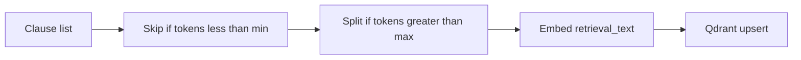

# Spec 2 — Ingest quality (skip + split)

**Depends on:** Spec 1 (search) — done. **Does not wait on:** LLM rewrite, EmbeddingProvider, richer inputs, KG ingest.

PRD: clauses under 5 tokens are excluded from semantic search; clauses over 512 tokens are split at sentence boundaries with 50-token overlap for embedding only. The original `Clause` remains the unit cited in findings.

Today every clause in `DOC_*.json` is embedded as one point keyed by `(document_id, clause_id)`. Short headings pollute the index. A rare dense paragraph becomes one noisy vector.



## Token counting

Whitespace-separated tokens on `clause_text` (not `retrieval_text` — a section title must not inflate a 3-word heading into a keep). No tiktoken. Config:

- `VECTORIZATION_MIN_CLAUSE_TOKENS` default `5`
- `VECTORIZATION_MAX_CLAUSE_TOKENS` default `512`
- `VECTORIZATION_CHUNK_OVERLAP_TOKENS` default `50`

Helper in [vectorization/src/vectorization/models.py](vectorization/src/vectorization/models.py) or a small `chunking.py`:

```python
def token_count(text: str) -> int:
  return len(text.split())
```

## Skip

`clause_to_embeddable` (or a wrapper `clauses_to_embeddable(clauses) -> list[EmbeddableRecord]`) **omits** clauses with `token_count(clause_text) < min_clause_tokens`. Pipeline logs how many were skipped. They are not upserted. Search does not need a new filter — those points simply do not exist.

## Split

If `token_count(clause_text) > max_clause_tokens`, split `clause_text` at sentence boundaries (`.`, `?`, `!` followed by space or end). Build chunks that are ≤ max tokens. Adjacent chunks overlap by `chunk_overlap_tokens` (prefix the next chunk with the last N tokens of the previous chunk’s text).

Each chunk becomes its own `EmbeddableRecord`:

- `clause_id` = original `clause.clause_id` (citation unit; SearchHit still reports this)
- `clause_text` = original full clause text (payload keeps the source clause)
- `retrieval_text` = `section_title — chunk_text` (same join rule as today, but `chunk_text` not the full clause)
- `source` includes `chunk_index: int` starting at `0`

A clause that does not need splitting is `chunk_index=0` only.

## Point id

[point_id](vectorization/src/vectorization/store.py) today is UUID5 of `{document_id}:{clause_id}`. Two chunks of the same clause would overwrite each other.

Change to:

```python
def point_id(document_id: str, clause_id: str, chunk_index: int = 0) -> str:
  return str(uuid.uuid5(_POINT_NAMESPACE, f"document_clause:{document_id}:{clause_id}:{chunk_index}"))
```

The `document_clause:` prefix keeps ids disjoint from Spec 6 (`kg_obligation:` / `kg_section:`). Store reads `chunk_index` from `record.source.get("chunk_index", 0)`. Payload also stores `chunk_index`.

**Migration:** this formula does not match existing live points. After implement, delete the `document_clauses` collection (or `docker compose down -v` for the Qdrant volume) and re-ingest. Document that in the README. Do not write a dual-id compatibility layer.

`VectorStore.search` is unchanged. Hits may include `chunk_index` in `payload`; `SearchHit.clause_id` stays the original clause.

## Pipeline

[pipeline.py](vectorization/src/vectorization/pipeline.py) `run()` uses the skip/split helper instead of a 1:1 `clause_to_embeddable` over every clause. CLI ingest command unchanged.

## Tests (TDD)

Extend [vectorization/tests/test_models.py](vectorization/tests/test_models.py) (and store tests for `point_id`):

- `"a b c"` (3 tokens) is skipped; 5+ tokens is kept
- section title does not count toward skip
- a 600-token clause (repeat a word) yields ≥2 records, same `clause_id`, distinct `chunk_index`, each chunk `token_count(chunk_text) ≤ 512`
- overlap: second chunk starts with the last 50 tokens of the first chunk
- `point_id(doc, clause, 0) != point_id(doc, clause, 1)`
- `point_id(doc, clause, 0)` is stable across calls
- no live Qdrant/Ollama

## Out of scope

- LLM `retrieval_text` (Spec 4)
- EmbeddingProvider / Sentence Transformers (Spec 3)
- EntityClause / ContextualClause (Spec 5)
- KG ingest ([Spec 6](vector_kg_ingest.plan.md) — implement later; file/JSON, no Neo4j)
- Re-embed job (Spec 7)
- Hybrid Neo4j fusion

## After you approve

Implement against this file before Specs 3–5, 6, and 7. Use namespaced point ids `document_clause:{document_id}:{clause_id}:{chunk_index}` so Spec 6 can add `kg_obligation:` / `kg_section:` keys without colliding.
