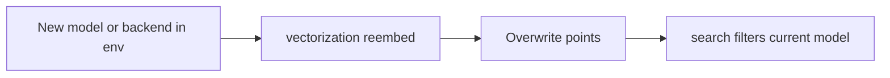

# Spec 7 — Re-embed migration

**Depends on:** Spec 1 (search filters `embedding_model_version`). Spec 3 if the change is backend/model, not required to land the CLI. **Does not wait on:** retrieval_text, richer inputs. **KG-first re-embed (PRD §14.6)** waits on [Spec 6](vector_kg_ingest.plan.md) (`run_kg` then document `run`).

PRD §14.6: when the embedding model is upgraded, re-embed KG points first, validate on an eval set, then lazily re-embed document clauses. Old **reports** keep their original `embedding_model_version` and are never silently re-scored.

This package has **document clauses only**. There is no eval set (PRD §20.4) and no reports DB. Do not build those here.

Search already drops points whose `embedding_model_version` ≠ `settings.embedding_model`. Changing `VECTORIZATION_EMBEDDING_MODEL` without re-ingest means search returns **nothing** (or only leftover points that happen to match the new name).

`upsert_batch` overwrites by `point_id`. Re-running ingest with the new model **replaces** vectors and payload `embedding_model_version` for those ids. That is the migration.



## CLI

```bash
vectorization reembed
```

Implementation: call the same `run(settings)` as default ingest. Do not duplicate the embed loop. Optional `--yes` is unnecessary (no prompt in this CLI).

Default `vectorization` (no subcommand) stays ingest. `reembed` is an alias with README framing, not a second code path.

## Operator procedure (README)

1. Stop search/ingest consumers if any (local: none).
2. Set `VECTORIZATION_EMBEDDING_BACKEND` / `VECTORIZATION_EMBEDDING_MODEL` / `VECTORIZATION_EMBEDDING_DIM` (dim must match the new model **and** the Qdrant collection; nomic and all-mpnet-base-v2 are both 768, so the collection can stay).
3. If **dimension changes**, delete the collection (or recreate the Compose volume) before reembed — Qdrant cannot mix vector sizes in one collection. Spec this as a required manual step; do not auto-delete in code.
4. `vectorization reembed` (same as ingest from `VECTORIZATION_CLAUSES_DIR`).
5. `vectorization search "..."` should return hits with `embedding_model_version` equal to the new model id.

If Spec 2 changed `point_id` and old points used the previous formula, delete the collection once (already in Spec 2 README) rather than leaving orphans.

**Reports:** vectorization does not touch reports. Document one sentence: old reports must keep their stored model version; this job only updates Qdrant.

**Leftover points:** if `clauses_dir` no longer contains a document that was ingested under the old model, those points remain. Search will not return them after the model id changes. Optional later: scroll-delete by old `embedding_model_version`. **Out of this spec** unless it is a 10-line helper; prefer documenting “delete collection if you need a clean index.”

## Tests (TDD)

- `main(["reembed"])` invokes `run` (mock `run`)
- Existing upsert tests already write `embedding_model_version` from settings — add one pipeline-level test with mocked embedder+store: after run, upserted payload model equals `settings.embedding_model`

No live Qdrant. No eval gold set.

## Out of scope

- Background job / queue
- Eval set and quality gate (PRD §20.4)
- Lazy per-document re-embed on report generation
- Re-embedding `kg_obligation` first until Spec 6 lands, then extend this CLI
- Hybrid fusion
- Auto-dropping the Qdrant collection

## After you approve

Implement last among Specs 2–5 and 7. Spec 6 (KG ingest) will extend this to “KG points first, then documents” when graph_builder is ready.
