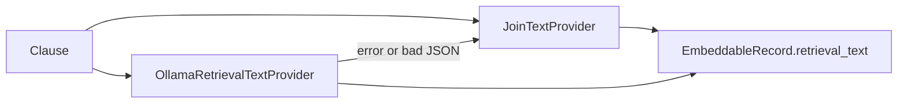

# Spec 4 — Optional LLM `retrieval_text`

**Depends on:** Spec 1 (done). Spec 3’s provider factory is nice-to-have, not required (this is a **generate** call, not embeddings). **Does not wait on:** KG, richer inputs.

Today [clause_to_embeddable](vectorization/src/vectorization/models.py) always embeds `section_title — clause_text`. `semantic_graph` already has `LLMRetrievalSummarizer` + prompts, but that addon is **not an installed package** (`from semantic_graph.retrieval_enrichment...` does not resolve). Do not wire that import.

Default stays **off**. Rewrite is an opt-in for better semantic match, not a requirement for ingest.



## Behavior

`VECTORIZATION_RETRIEVAL_TEXT` = `off` (default) | `ollama`.

Protocol in vectorization (not semantic_graph):

```python
class RetrievalTextProvider(Protocol):
  def retrieval_text(self, clause: Clause) -> str: ...
```

**JoinTextProvider:** current join (`section_title — clause_text`, omit blank title). This is also the fallback.

**OllamaRetrievalTextProvider:** POST to Ollama **generate** (not embeddings). New setting `VECTORIZATION_OLLAMA_GENERATE_URL` default `http://localhost:11434/api/generate`. Model: `VECTORIZATION_RETRIEVAL_LLM_MODEL` default `llama3.2` (must be an installed generate model; `nomic-embed-text` cannot do this). Copy the existing system/user prompt from [prompts.py](semantic_graph/src/semantic_graph/retrieval_enrichment_addon/semantic_graph/retrieval_enrichment/prompts.py) into `vectorization/src/vectorization/retrieval_text.py` — do not import across the broken path.

Request body: `{"model", "prompt", "system", "stream": false, "format": "json"}`. Parse `response.json()["response"]` as JSON with a non-empty `retrieval_text` string.

**Failure policy (hard):** any HTTP error, timeout, non-JSON, missing/empty `retrieval_text` → log warning with `clause_id`, return JoinTextProvider output. Never raise out of `clause_to_embeddable` / ingest for rewrite failures.

`act` / `section_label` for the prompt: `section_title` as section; act is `"unknown"` until document metadata has a law name (do not block on that).

## Wiring

```python
def clause_to_embeddable(
  clause: Clause,
  retrieval: RetrievalTextProvider | None = None,
) -> EmbeddableRecord:
```

Default `None` → JoinTextProvider so existing tests stay valid.

[pipeline.py](vectorization/src/vectorization/pipeline.py) constructs the provider from settings and passes it in. Skip/split from Spec 2 (if already landed) still run on `clause_text`; rewrite runs **per embeddable record** on the text that will be embedded (`chunk_text` after split, full clause otherwise). After split, call rewrite on each chunk’s retrieval source text, not the unsplit clause, so the LLM is not asked to summarize 600 tokens that were already chunked.

If Spec 2 is not implemented yet, rewrite the full `clause_text` once.

Do not add FastAPI. No change to `vectorization search` except it already returns stored `retrieval_text`.

## Tests (TDD)

- default / `off`: same join strings as today’s tests
- mocked generate 200 + `{"retrieval_text": "Controllers must ..."}` → that string is stored
- mocked 500 / timeout / `{bad}` / `{"retrieval_text": ""}` → join fallback, no exception
- `off` must not call HTTP

No live Ollama in CI. Do not add a generate model to the default local setup docs as required — only when the flag is `ollama`.

## Out of scope

- Installing or requiring a chat LLM for normal ingest
- Importing `semantic_graph.retrieval_enrichment`
- Mandatory rewrite
- KG ingest (Spec 6)

## After you approve

Implement after Spec 2 so rewrite applies to chunks. Can land in parallel with Spec 5.
