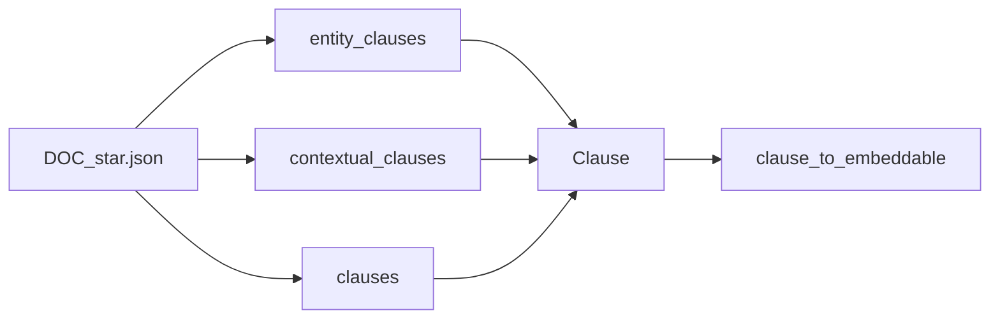

# Spec 5 — Richer document input

**Depends on:** Spec 1 (done). Works with Spec 2 skip/split (count tokens on unwrapped `clause_text`). **Does not wait on:** document_pipeline orchestrator wiring `document_understanding` → `context_builder` → `entity_extractor`. **Does not wait on:** KG ingest.

Today [load_segmented_documents](vectorization/src/vectorization/pipeline.py) only accepts `DOC_*.json` as `SegmentedDocument` (`clauses: list[Clause]`). That is what `document-pipeline preview` writes. `ContextualClause` / `EntityClause` exist as **dataclasses** in document_pipeline and are not in the preview artifact.

Phase 2 of [plan.md](plan.md) says embed `ContextualClause` / `EntityClause`. This spec makes vectorization **accept those shapes when the JSON has them**, and keep working on today’s preview files.



## Unwrap

Add helpers in [vectorization/src/vectorization/models.py](vectorization/src/vectorization/models.py) (or `sources.py`):

```python
def clause_from_contextual(cc: ContextualClause) -> Clause:
  return cc.classified_clause.clause

def clause_from_entity(ec: EntityClause) -> Clause:
  return ec.contextual_clause.classified_clause.clause
```

If `classified_clause` / nested `clause` is missing, skip that item and log — do not crash the whole file.

## Loader

`load_segmented_documents` stays the name (or rename to `load_documents` if you touch the README anyway). For each `DOC_*.json`:

1. If top-level `entity_clauses` is a non-empty list → treat as entity-enriched. Build `Clause` list via unwrap. Pass each `EntityClause` into `entity_clause_to_embeddable` (below).
2. Else if `contextual_clauses` is non-empty → unwrap `ContextualClause`.
3. Else validate as `SegmentedDocument` (today).

Do not require pydantic models for the dataclass types. Parse with `json` + attribute construction in tests; for JSON, accept dicts with the nested keys `contextual_clause.classified_clause.clause` / `classified_clause.clause` matching how a future serializer would dump them (`mode=json` / `asdict`). Unknown extra keys ignored.

Preview files that only have `clauses` must keep loading without change.

## Retrieval text extras

Still start from Spec 4’s provider / join (`section_title — clause_text`). Then, if present:

- `StructuralRole` other than `STATEMENT` / `UNKNOWN`: append ` (role: HEADING)` (or the enum value)
- Entity labels: append ` (entities: ORG, DATE)` using unique `entity_type` values, insertion order, cap at 8 types

This is **not** a substitute for LLM rewrite. Skip/split still use raw `clause_text` token counts, not the decorated string.

HEADING clauses that are also under min tokens are still skipped by Spec 2.

## Tests (TDD)

- Fixture dict with only `clauses` → same records as today
- Nested entity JSON → same `clause_id` / `clause_text` as the inner Clause; retrieval_text contains an entity type
- Contextual JSON with `role=HEADING` → retrieval_text contains `HEADING`
- Malformed nested item skipped; sibling clauses still ingested
- No live Qdrant/Ollama
- No requirement that `document-pipeline preview` emit the new keys in this spec

## Out of scope

- Wiring entity_extractor into the document_pipeline orchestrator or preview CLI
- Converting context/entity dataclasses to pydantic in document_pipeline (unless a tiny dump helper is the cleanest way to define the JSON contract — prefer documenting the nested key paths)
- KG ingest (Spec 6)
- Neo4j

## After you approve

Implement after Spec 2 so skip/split apply to unwrapped clauses. Independent of Spec 4 (if both exist, extras apply after rewrite or after join).
