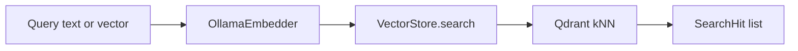

# Spec 1 — VectorStore search (kNN)

**Recommendation:** generic search API now, not PRD obligation-matching yet.

PRD §14.5 is “embed a document clause → search `kg_obligation`.” Those points do not exist. Building that first would force KG ingest into this spec. Searching only document clauses would bake the wrong product meaning into the API.

Do this instead: one `VectorStore.search` that filters on `source_type` / `embedding_model_version` / optional `document_id`. Default `source_type=document_clause` so it works today. Later KG ingest reuses the same method with `source_type="kg_obligation"`.

LLM `retrieval_text`, EntityClause input, Sentence Transformers, and KG ingest stay out of this spec.



## Behavior

Add to [vectorization/src/vectorization/store.py](vectorization/src/vectorization/store.py):

```python
def search(
  self,
  query_vector: list[float],
  *,
  top_k: int = 10,
  min_score: float = 0.55,
  source_type: str = "document_clause",
  document_id: str | None = None,
) -> list[SearchHit]:
```

- L2-normalize `query_vector` (same as upsert; cosine + unit vectors).
- Reject wrong dimension with `ValueError` (same as upsert).
- Qdrant query with must-filters:
  - `source_type`
  - `embedding_model_version` = current `settings.embedding_model` (never mix models)
  - `document_id` if provided
- Request `top_k` from Qdrant, then drop hits with score `< min_score` (PRD 14.5 noise floor, default `0.55`).
- Do not create the collection here; search on a missing collection raises from the client (ingest is what creates it).

`SearchHit` (new small model in [vectorization/src/vectorization/models.py](vectorization/src/vectorization/models.py) or next to the store):

- `score: float`
- `source_type`, `document_id`, `clause_id`, `section_id`
- `clause_text`, `retrieval_text`
- `embedding_model_version`
- plus `payload: dict` for the rest (`law_code`, `obligation_id`, …) so KG fields appear later without a model change

Helper for text queries (not a second store backend): in [vectorization/src/vectorization/pipeline.py](vectorization/src/vectorization/pipeline.py) or a thin `search.py`:

```python
def search_text(query: str, settings=None, **search_kwargs) -> list[SearchHit]
```

Embeds `query` via `OllamaEmbedder`, then calls `store.search`. Ingest `run()` stays the default CLI.

**CLI:** add a `search` subcommand so you can try it without writing Python:

```bash
vectorization              # ingest (unchanged)
vectorization search "personal data" --top-k 5
```

Keep argparse local to [vectorization/src/vectorization/cli.py](vectorization/src/vectorization/cli.py). Print JSON lines of hits (score + clause_id + retrieval_text). No FastAPI.

**Config:** optional `VECTORIZATION_SEARCH_TOP_K` (default 10) and `VECTORIZATION_SEARCH_MIN_SCORE` (default 0.55) on [VectorizationSettings](vectorization/src/vectorization/config/settings.py). `.env.example` + README.

## Tests (TDD)

Extend [vectorization/tests/test_store.py](vectorization/tests/test_store.py) with a mocked Qdrant client (same pattern as upsert tests):

- `search` calls `query_points` / `search` with collection name and a cosine query vector of unit length
- filter includes `source_type` and `embedding_model_version`
- optional `document_id` added to the filter
- scores below `min_score` are omitted
- wrong vector dim raises `ValueError`

No live Qdrant or Ollama in CI.

## Out of scope (later specs)

Written (review, then implement in order 2 → 3 → 4/5 → 6 → 7):

- [Spec 2 ingest quality](vector_ingest_quality.plan.md) — skip &lt;5 tokens, split &gt;512
- [Spec 3 EmbeddingProvider](vector_embedding_provider.plan.md) — Ollama default, optional ST
- [Spec 4 retrieval_text](vector_retrieval_text.plan.md) — optional LLM rewrite
- [Spec 5 richer inputs](vector_richer_inputs.plan.md) — EntityClause / ContextualClause JSON
- [Spec 6 KG ingest](vector_kg_ingest.plan.md) — file/JSON `kg_obligation` / `kg_section` (no live Neo4j)
- [Spec 7 re-embed](vector_reembed_migration.plan.md)

Deferred:

- Hybrid fusion with Neo4j
- Dump GraphIR/Neo4j → Spec 6 JSON (wire graph_builder later)

## After you approve

Implement against this file. Later specs go in `.cursor/plans/` (repo) and stay in `~/.cursor/plans/` so the Plan preview tab keeps working.
