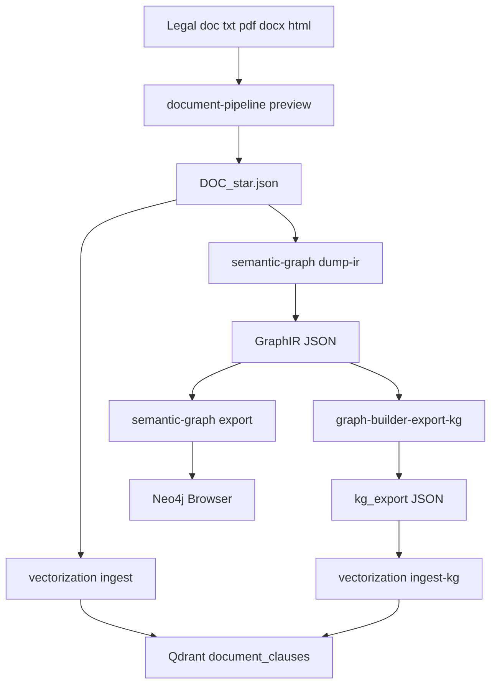
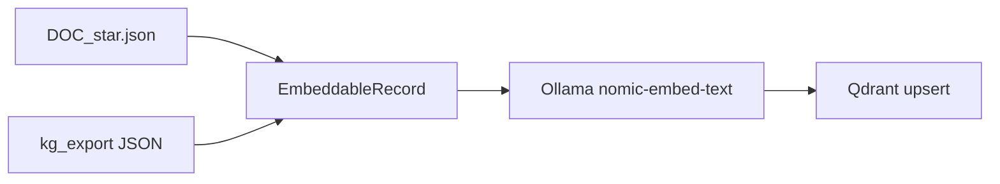
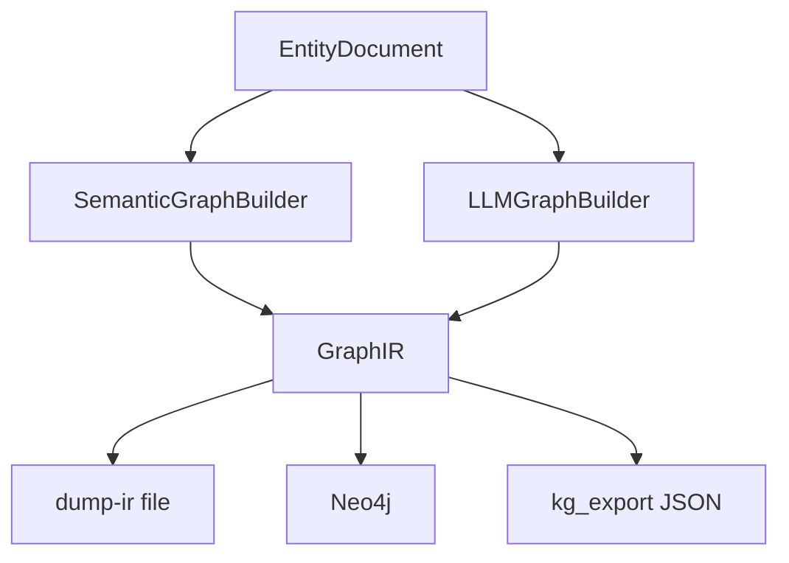

# PolarisLex architecture (current state)

PolarisLex is a legal-document intelligence stack. Today it **parses** documents, **embeds** clauses for search, **builds a graph** for structure, can **overlay** a private-company website privacy policy against an ideal topic graph from DPDP / SPDI / CERT-In / IT Act, and can **analyze** that policy for obligation gaps and linked penalties (India MVP). It does **not** yet generate LLM reports or traverse Neo4j obligations.

Packages are independently installable. Vector search and Neo4j do **not** import each other. The product UI does **not** use Neo4j Browser. The join for law overlay is the four `*_graph.json` files at the repo root.

Interactive walkthrough: open the Cursor canvas beside chat (`polarislex-architecture.canvas.tsx`).

## What this is

| Layer | Package | What it does |
|---|---|---|
| Parse | `document_pipeline/` | File → structured `DOC_*.json` |
| Embed | `vectorization/` | JSON → Qdrant vectors + search |
| Graph IR | `graph_builder/` | GraphIR schema, LLM builder, kg_export dump |
| Graph CLI | `semantic_graph/` | Hierarchy builder, `dump-ir`, Neo4j export |
| Compare | `policy_compare/` | Ideal topic graph + overlay match; FastAPI `/compare` and `/analyze` |
| Analyze | `compliance/` | Obligation / gap / penalty findings (India) |
| UI | `web/` + `docker/` | Upload policy, graphs + inspector (`localhost:8080`) |

**Stores:** JSON files, Qdrant (`localhost:6333`), Neo4j (`localhost:7474` / Bolt `7687`). Embeddings: local Ollama (`localhost:11434`), default `nomic-embed-text`. Product compare API is FastAPI in Docker (`localhost:8000`). No SQLite, no Postgres.

## End-to-end (built)

A document is parsed once. Embedding and graph are optional downstreams.



## Document intelligence

```mermaid
flowchart LR
  loader --> cleaner --> sections[section_extractor]
  sections --> blocks[block_extractor]
  blocks --> builder[clause_builder]
  builder --> extractor[clause_extractor]
  extractor --> understand[document_understanding]
  understand --> context[context_builder]
  context --> entities[entity_extractor]
  entities --> preparer[DefaultLLMPreparer]
```

`document-pipeline preview <file>` calls `create_default_orchestrator()` and writes `document_pipeline/output/DOC_*.json`.



- Formats: `.txt`, `.pdf`, `.docx`, `.html` / `.htm`.
- Entities are dictionary/regex, not an LLM classifier.
- Preview JSON includes `clauses`, nested `contextual_clauses`, and `entity_clauses`.
- Heading regression: six synthetic policies in `document_pipeline/tests/fixtures/policies/`.

`DefaultLLMPreparer` produces `SemanticExtractionInput`. It does not call a chat model.

## Vector path

`vectorization` reads `DOC_*.json` (default `../document_pipeline/output`). It does not import `graph_builder` and does not open Neo4j.

**Embed text:** `section_title — clause_text`. For nomic, prefixes `search_document:` (ingest) and `search_query:` (search) are added at embed time only; they are not stored in Qdrant payload.

**Guards:** skip clauses under 5 tokens; split over 512 tokens at sentence boundaries with 50-token overlap. Original `clause_id` stays the citation; each chunk is its own point.

**Collection:** `document_clauses` (name is historical). Search filters `source_type` and the current embedding model. Hits below score 0.55 are dropped.



### Point-id namespaces (same collection)

| `source_type` | Key |
|---|---|
| `document_clause` | `document_clause:{document_id}:{clause_id}:{chunk_index}` |
| `kg_obligation` | `kg_obligation:{law_code}:{obligation_id}:{chunk_index}` |
| `kg_section` | `kg_section:{law_code}:{section_id}:{chunk_index}` |

Keys are hashed to a stable UUID so reruns overwrite instead of duplicating.

`vectorization ingest-kg` loads `*.json` from `VECTORIZATION_KG_DIR` (default `../kg_export`). KG paragraphs split at 300 tokens. Empty `text` is skipped. `reembed` runs KG ingest first, then document ingest.

## Graph path

Two builders, one IR (`nodes` + `relationships`).



### SemanticGraphBuilder (CLI today)

Used by `semantic-graph dump-ir` and `semantic-graph export`. Hierarchy + reference resolution. No LLM.

Neo4j label map:

| GraphIR | Neo4j |
|---|---|
| `LawVersion` | `Document` |
| `Section` / `SubSection` | `Section` |
| `HAS_SECTION` / `HAS_CHAPTER` / `HAS_SUBSECTION` | `CONTAINS` |
| `HAS_CLAUSE` | `HAS_CLAUSE` |

Unnumbered headings become **sibling** Sections under Document. Nesting is parked, not a missing export.

### LLMGraphBuilder

`GraphBuilderPipeline`: EntityDocument → LLM JSON → GraphIR → validator → Cypher → optional Neo4j. This is the path that emits **Obligation** nodes (`subject` / `action` / `object` / `condition` / `exception`). `dump-ir` does not run it, so a policy dump often has no obligations for `ingest-kg`.

### File join (no Neo4j)

1. `semantic-graph dump-ir statute.txt -o ir.json`
2. `graph-builder-export-kg ir.json -o ../kg_export/LAW.json --law-code LAW`
3. `vectorization ingest-kg`

`graph-builder-export-kg` keeps Section/Obligation text. Blank items are omitted.

## CLI cheat sheet

```bash
# Parse
document-pipeline preview path/to/policy.txt

# Vectors (from vectorization/)
docker compose up -d qdrant
vectorization
vectorization search "personal data" --top-k 5
vectorization ingest-kg
vectorization search "access personal data" --source-type kg_obligation --top-k 5
vectorization reembed

# Graph without Neo4j
semantic-graph dump-ir statute.txt -o ir.json
graph-builder-export-kg ir.json -o ../kg_export/LAW.json --law-code LAW

# Graph into Neo4j
docker compose up -d neo4j
semantic-graph export statute.txt
semantic-graph export statute.txt --ir-output ir.json

# Product UI (policy overlay + analysis)
docker compose up --build web api
# Qdrant (compose) + Ollama on the host (embeddings for /analyze)
# open http://localhost:8080
```

Qdrant dashboard: `http://localhost:6333/dashboard`. Neo4j Browser: `http://localhost:7474` (credentials are in root `docker-compose.yml`, not repeated here).

## Product UI (Docker)

```bash
docker compose up --build web api
# UI: http://localhost:8080   API: http://localhost:8000/health
```

`POST /compare` (multipart file) runs `document_pipeline`, projects the four law JSON files into topic hubs, and returns two view graphs plus match links. Matching is **lexical topic keywords**; it does not need Qdrant or Ollama.

`POST /analyze` (same upload, optional form `jurisdiction` default `IN`) scores policy clauses against `kg_obligation` vectors in Qdrant (`vectorization.search_text`) and attaches penalties from the four law JSON files. Response is `AnalysisResult` (findings), not pipeline “context.” The inspector shows applicable laws, covered vs gaps, and penalty lines. Analyze does **not** upsert the uploaded policy into Qdrant. If Qdrant or Ollama is down, `/analyze` returns **503**; `/compare` still works.

Analyze v1 does **not** traverse Neo4j. `semantic-graph dump-ir` still has no Obligation nodes. A later increment can join GraphIR obligations once they exist.

The UI is landing (load a policy) then a graph-first workspace. Untitled `S001` is labeled **Introduction**. Clauses stay in node summaries (click), not as a 246-node star.

## Not in this build

- Neo4j obligation traversal (Phase 4 increment after GraphIR has Obligation nodes)
- Report generation and a reports database (Phase 5)
- Hybrid graph+vector fusion at query time
- LLM `retrieval_text` rewrite (Spec 4, parked)
- Smarter overlay matching (embeddings / LLM labels / obligation graph) — parked in `plan.md` (“Later — smarter matching”)
- Pluggable jurisdictions beyond India website-privacy MVP

## Decisions worth stating

- **Privacy:** local Ollama embeddings by default; other embedders are a settings swap.
- **Stores:** JSON parsed artifacts, Qdrant vectors, Neo4j graph. JSON files are the parsed store (SQLite will not be added).
- **Naming:** structural `ContextBuilder` is document structure only. Engine output is `AnalysisResult`.
- **Isolation:** `vectorization` never imports `graph_builder` and never opens a Neo4j driver.
