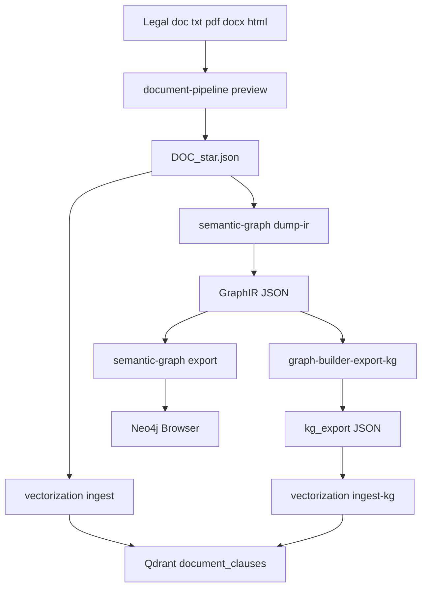
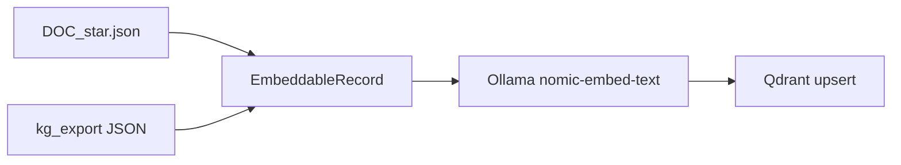
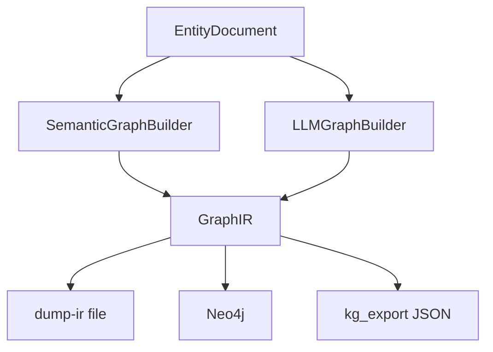
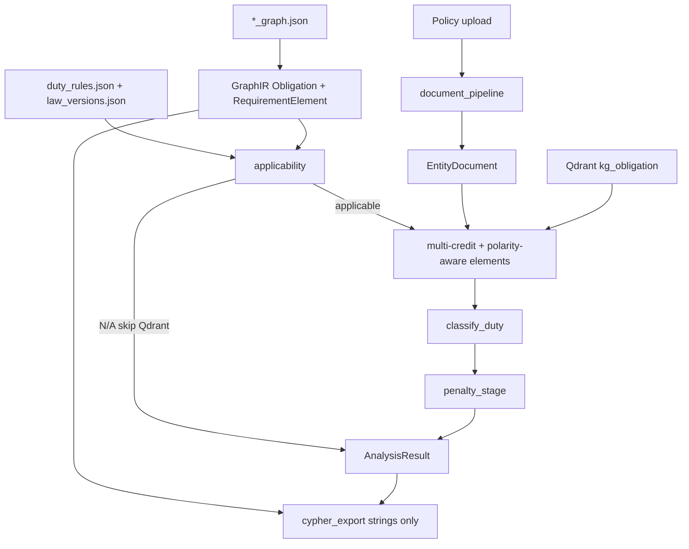

# PolarisLex architecture (current state)

PolarisLex is a legal-document intelligence stack. Today it **parses** documents, **embeds** clauses for search, **builds a graph** for structure, can **overlay** a private-company website privacy policy against an ideal topic graph from DPDP / SPDI / CERT-In / IT Act, can **analyze** that policy with a deterministic compliance reasoning engine (applicability, multi-credit matching, requirement elements, statuses, penalties), and can **write a client memo + PDF** from those findings (India MVP).

`/analyze` builds GraphIR in-process (Obligation + `RequirementElement` + `PENALIZES`). It does **not** open Bolt or traverse Neo4j. Qwen does **not** classify statuses.

Packages are independently installable. Vector search and Neo4j do **not** import each other. The product UI does **not** use Neo4j Browser. Law overlay and analyze both read the four `*_graph.json` files at the repo root. Duty metadata (roles, document types, elements, severity) lives in a sidecar: `compliance/src/compliance/data/duty_rules.json` and `law_versions.json`.

Interactive walkthrough: open the Cursor canvas beside chat (`polarislex-architecture.canvas.tsx`).

## What this is

| Layer | Package | What it does |
|---|---|---|
| Parse | `document_pipeline/` | File → structured `DOC_*.json` |
| Embed | `vectorization/` | JSON → Qdrant vectors + search |
| Graph IR | `graph_builder/` | GraphIR schema, LLM builder, kg_export dump, `catalog_to_graph_ir` |
| Graph CLI | `semantic_graph/` | Hierarchy builder, `dump-ir`, Neo4j export |
| Compare | `policy_compare/` | Ideal topic graph + overlay match; FastAPI `/compare`, `/analyze`, `/report` |
| Analyze | `compliance/` | Applicability, matching, classify, penalties, memo + PDF (India) |
| UI | `web/` + `docker/` | Upload policy, graphs + findings + report (`localhost:8080`) |

**Stores:** JSON files, Qdrant (`localhost:6333`), Neo4j (`localhost:7474` / Bolt `7687`). Embeddings: local Ollama (`localhost:11434`), default `nomic-embed-text`. Product API is FastAPI in Docker (`localhost:8000`). No SQLite, no Postgres.

## End-to-end (built)

A document is parsed once. Embedding and graph are optional downstreams. Product analyze uses the parsed `EntityDocument` plus in-process catalog GraphIR and Qdrant `kg_obligation` search — it does not re-ingest the upload.



## Document intelligence

```mermaid
flowchart LR
  loader --> cleaner --> sections[section_extractor]
  sections --> blocks[block_extractor]
  blocks --> builder[clause_builder]
  builder --> extractor[clause_extractor]
  extractor --> understand[document_understanding]
  understand --> context[context_builder]
  context --> entities[entity_extractor]
  entities --> preparer[DefaultLLMPreparer]
```

`document-pipeline preview <file>` calls `create_default_orchestrator()` and writes `document_pipeline/output/DOC_*.json`.



- Formats: `.txt`, `.pdf`, `.docx`, `.html` / `.htm`.
- Entities are dictionary/regex, not an LLM classifier.
- Preview JSON includes `clauses`, nested `contextual_clauses`, and `entity_clauses`.
- Heading regression: six synthetic policies in `document_pipeline/tests/fixtures/policies/`.

`DefaultLLMPreparer` produces `SemanticExtractionInput`. It does not call a chat model.

## Vector path

`vectorization` reads `DOC_*.json` (default `../document_pipeline/output`). It does not import `graph_builder` and does not open Neo4j.

**Embed text:** `section_title — clause_text`. For nomic, prefixes `search_document:` (ingest) and `search_query:` (search) are added at embed time only; they are not stored in Qdrant payload.

**Guards:** skip clauses under 5 tokens; split over 512 tokens at sentence boundaries with 50-token overlap. Original `clause_id` stays the citation; each chunk is its own point.

**Collection:** `document_clauses` (name is historical). Search filters `source_type` and the current embedding model. The CLI default drops hits below **0.55**. `/analyze` searches `kg_obligation` with a **0.30** floor (`PARTIAL_SCORE`) so partial hits are not discarded before classification.



### Point-id namespaces (same collection)

| `source_type` | Key |
|---|---|
| `document_clause` | `document_clause:{document_id}:{clause_id}:{chunk_index}` |
| `kg_obligation` | `kg_obligation:{law_code}:{obligation_id}:{chunk_index}` |
| `kg_section` | `kg_section:{law_code}:{section_id}:{chunk_index}` |

Keys are hashed to a stable UUID so reruns overwrite instead of duplicating.

`vectorization ingest-kg` loads `*.json` from `VECTORIZATION_KG_DIR` (default `../kg_export`). KG paragraphs split at 300 tokens. Empty `text` is skipped. `reembed` runs KG ingest first, then document ingest.

## Graph path

Two builders, one IR (`nodes` + `relationships`).



### SemanticGraphBuilder (CLI today)

Used by `semantic-graph dump-ir` and `semantic-graph export`. Hierarchy + reference resolution. No LLM unless `dump-ir --enrich`.

Neo4j label map:

| GraphIR | Neo4j |
|---|---|
| `LawVersion` | `Document` |
| `Section` / `SubSection` | `Section` |
| `Obligation` | `Obligation` |
| `RequirementElement` | `RequirementElement` |
| `Penalty` | `Penalty` |
| `HAS_SECTION` / `HAS_CHAPTER` / `HAS_SUBSECTION` | `CONTAINS` |
| `HAS_CLAUSE` | `HAS_CLAUSE` |
| `HAS_OBLIGATION` | `HAS_OBLIGATION` |
| `HAS_REQUIREMENT` | `HAS_REQUIREMENT` |
| `PENALIZES` | `PENALIZES` |

Unnumbered headings become **sibling** Sections under Document. Nesting is parked, not a missing export.

India catalog duties enter GraphIR via `semantic-graph from-catalog` or in-process `catalog_to_graph_ir` (same `doc_id`s as `/analyze`). Requirement elements are lifted from `duty_rules.json` onto `HAS_REQUIREMENT`. `dump-ir --enrich` is a separate LLM slot extract; those ids are not catalog ids.

### LLMGraphBuilder

`GraphBuilderPipeline`: EntityDocument → LLM JSON → GraphIR → validator → Cypher → optional Neo4j. Still unused by dump-ir (which uses `SemanticEnrichmentStage` only when `--enrich`).

### File join (no Neo4j)

1. `semantic-graph from-catalog dpdp_graph.json … -o catalog-ir.json` (India duties)
2. `semantic-graph dump-ir statute.txt -o ir.json` (outline; add `--enrich` for slot Obligation nodes)
3. `graph-builder-export-kg ir.json -o ../kg_export/LAW.json --law-code LAW`
4. `vectorization ingest-kg`

`graph-builder-export-kg` keeps Section/Obligation text. Blank items are omitted.

## Compliance reasoning engine

Hosted by `policy_compare` FastAPI. Core loop is `compliance.analyze_document`. LLM never decides `covered` / `partial` / `missing`.

Default profile for a website privacy policy: document type `privacy_policy`, roles `ENTITY_DATA_FIDUCIARY` + `ENTITY_BODY_CORPORATE`. Optional form fields: `analysis_date` (`YYYY-MM-DD`), `roles` (comma-separated).



1. **Catalog + sidecar.** 63 catalog obligation ids from the four law graphs. `duty_rules.json` adds roles, document types, requirement-element keywords, severity, generic-language tags. `law_versions.json` marks acts ACTIVE / PARTIALLY_COMMENCED / SUPERSEDED (SPDI is still scored).
2. **Applicability first.** `apply_duty` checks jurisdiction, roles, document type, and law version. N/A duties (CA / e-sign IT Act, Consent Manager, CERT-In operational_security, and so on) skip Qdrant, stay out of `gaps`, and are excluded from the coverage denominator.
3. **Matching.** Each policy clause (headings skipped) may credit **multiple** catalog hits at score ≥ 0.30. Exclusive top-1 matching is gone. Requirement-element keywords are scored only on **credited** clauses (and “Section N” neighbours), not a full-document sweep. Denial polarity (`cannot`, `does not`, `without obtaining`, `waive`, …) does not satisfy an element. `find_contradictions` scans **all** clauses for `contradiction_cues`. Generic legal language is tagged, not treated as coverage.
4. **Classify.** Statuses: `covered | partial | missing | not_applicable | undetermined | conflict | violation`. A material contradiction cue is never `covered` (`violation`, or `conflict` when a positive credited clause also exists). Majority-element coverage (`ELEMENT_COVERED_RATIO` 0.60) plus HIGH evidence is required for `covered`. Elements are `supported | contradicted | absent`. Missing policy language is **not** a violation or a finding of liability. Report arithmetic: applicable mix equals `total`; `total + not_applicable` equals catalog size (63 for India).
5. **Penalties.** After status. `potential_exposure` vs `may_trigger`. Never attached to covered or N/A. Copy states this is not a determination of liability.
6. **Cypher.** `compliance.cypher_export` emits MATCHED_BY / HAS_REQUIREMENT / SUPPORTED_BY / CONFLICTS_WITH / MAY_TRIGGER **strings**. Never executed against Bolt on `/analyze`.

Frozen pytest gold: `compliance/tests/benchmark/` (stub search). Live BharatPay re-run needs Qdrant + Ollama.

## CLI cheat sheet

```bash
# Parse
document-pipeline preview path/to/policy.txt

# Vectors (from vectorization/)
docker compose up -d qdrant
vectorization
vectorization search "personal data" --top-k 5
vectorization ingest-kg
vectorization search "access personal data" --source-type kg_obligation --top-k 5
vectorization reembed

# Graph without Neo4j
semantic-graph dump-ir statute.txt -o ir.json
semantic-graph dump-ir --enrich statute.txt -o ir.json
semantic-graph from-catalog dpdp_graph.json spdi_graph.json certin_graph.json itact_graph.json -o catalog-ir.json
graph-builder-export-kg ir.json -o ../kg_export/LAW.json --law-code LAW

# Graph into Neo4j
docker compose up -d neo4j
semantic-graph export statute.txt
semantic-graph from-catalog dpdp_graph.json -o catalog-ir.json --to-neo4j
semantic-graph export statute.txt --ir-output ir.json

# Product UI (graphs + engine analysis + memo)
docker compose up --build web api
# Qdrant (compose) + Ollama on the host (embeddings for /analyze)
# open http://localhost:8080
```

Qdrant dashboard: `http://localhost:6333/dashboard`. Neo4j Browser: `http://localhost:7474` (credentials are in root `docker-compose.yml`, not repeated here).

## Product UI (Docker)

```bash
docker compose up --build web api
# UI: http://localhost:8080   API: http://localhost:8000/health
```

`--build` after engine or UI changes, then **Run Validation** again. A previous in-browser result (for example 21/63) is stale until you re-run against a rebuilt `api`.

`POST /compare` (multipart file) runs `document_pipeline`, projects the four law JSON files into topic hubs, and returns two view graphs plus match links. Matching is **lexical topic keywords**. It only groups User Graph folders (Consent vs Extra). It is **not** the coverage score and does **not** paint node colors after analyze. Compare does not need Qdrant or Ollama.

`POST /analyze` (same upload, optional form `jurisdiction` default `IN`, `analysis_date`, `roles`) builds GraphIR from the four law JSON files (`catalog_to_graph_ir` in-process; `compliance` imports `graph_builder`). Obligation node ids are the authoritative duty set. Qdrant `kg_obligation` search scores applicable ids only (`vectorization.search_text`, min score 0.30). A clause may credit several duties. **Covered** needs HIGH evidence plus title-token or requirement-element overlap. Gaps = missing + partial + undetermined + conflict + violation. N/A is excluded. Penalties come from GraphIR `PENALIZES` after status. Response is `AnalysisResult`. Analyze does **not** upsert the uploaded policy into Qdrant and does **not** open Neo4j. If Qdrant or Ollama is down, `/analyze` returns **503**; `/compare` still works.

The UI is landing (load a policy) then a graph-first workspace. Untitled `S001` is labeled **Introduction**. Clauses stay in node summaries (click), not as a 246-node star. Coverage strip, graph colors, and Findings follow `AnalysisResult` (applicable % , weighted %, covered / partial / missing / N/A / gaps). After analyze, `POST /report` assembles every duty into a client memo. Per-law Themes (2–3 missing/partial titles) and the first summary sentence (applicable-only scoreboard; missing ≠ violation) are engine-owned; Qwen may append extra briefing sentences. The Findings page shows **View Report** once that JSON is ready; the memo itself is a separate screen (`#report`). `POST /report.pdf` renders that JSON with ReportLab (upload filename, priority-gaps block, liability disclaimer); download does not call the chat model again. If chat is down, the scoreboard, duty table, and PDF still work (`narrative_available: false`).

## Not in this build

- Neo4j / Cypher **execution** at analyze time (`/analyze` uses in-process GraphIR + Qdrant; Cypher is export-only strings)
- GraphIR `applies_if` properties (runtime N/A is the sidecar + `applicability.py`, not a Cypher precondition on Obligation nodes)
- Durable reports database (optional `POLARIS_REPORT_DIR` JSON only; no SQLite)
- LLM `retrieval_text` rewrite (Spec 4, parked)
- Overlay embeddings / LLM labels for User Graph folders — parked; keywords stay clustering-only
- Pluggable jurisdictions beyond India website-privacy MVP
- Cloud chat (default local Ollama Qwen)

## Decisions worth stating

- **Privacy:** local Ollama embeddings by default; other embedders are a settings swap. Memo chat is local Qwen; compact report JSON still leaves the machine if a cloud `ChatFn` is wired later.
- **Stores:** JSON parsed artifacts, Qdrant vectors, Neo4j graph. JSON files are the parsed store (SQLite will not be added).
- **Naming:** structural `ContextBuilder` is document structure only. Engine output is `AnalysisResult`.
- **Isolation:** `vectorization` never imports `graph_builder` and never opens a Neo4j driver.
- **Classification:** statuses and coverage come from the engine, not Qwen. Missing ≠ legal violation.
