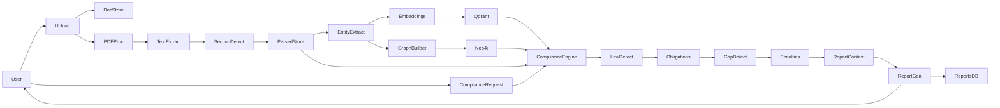

# PolarisLex — Project Plan

`document_pipeline/` is the preprocessing layer for PolarisLex: it ingests legal documents, extracts structure and entities, and produces artifacts for downstream compliance analysis. Everything after document intelligence (embeddings, graph, compliance engine, reports) is planned but not yet implemented.

## Architecture



## Current state

**Package:** `document_pipeline/` (Python 3.12+, pydantic v2, `pypdf`, `python-docx`; CLI via `document-pipeline preview <file>`).

| Status | Stages | Key files |
|---|---|---|
| Wired in orchestrator, tested | loader, cleaner, section_extractor, block_extractor, clause_builder, clause_extractor | `pipeline/stages/*.py`, `sectioning/heading_detector.py` |
| Built and tested, not wired | document_understanding, context_builder, entity_extractor | same |
| Interface only | llm_preparer (abstract — no concrete impl) | `pipeline/stages/llm_preparer.py` |

**Gaps:** orchestrator cannot run end-to-end (abstract `LLMPreparer`); CLI `preview` manually wires stages, stops at `clause_extractor`, and never uses the orchestrator; no HTML parser (`.txt/.pdf/.docx` only); no persistence beyond `output/DOC_*.json`; no LLM/API/DB. README still says "Architecture skeleton only" — update in Phase 1.

**Correct wiring order for unwired stages** (by input/output types):

```
clause_extractor → document_understanding → context_builder → entity_extractor
```

`LLMPreparer` currently accepts `SegmentedDocument`; reposition or update it to accept `EntityDocument` so chunks include classification, references, and entities.

**Out of scope today** (per README): compliance engine, knowledge graph, Neo4j, vector search, embeddings, LLM calls, APIs, database integration.

**188 unit tests passing.** Real-document benchmark: GitHub privacy policy → ~18/28 headings detected via `STANDALONE` heuristic in `heading_detector.py`.

## Phase 1 — Complete document intelligence (immediate)

- [ ] Wire `document_understanding` → `context_builder` → `entity_extractor` into orchestrator after `clause_extractor`.
- [ ] Implement concrete `LLMPreparer` (recommended: after entity extraction); update return type accordingly.
- [ ] Unify CLI `preview` with orchestrator; extend `PipelinePreviewArtifact` with classifications, references, and entities.
- [ ] Add real-policy fixture library (5–10 docs); use as regression suite for heading/sectioning.
- [ ] Patch `heading_detector` gaps found by fixtures (improve on ~18/28 benchmark).
- [ ] **Decision:** entity extraction strategy — extend dictionary/regex vs. LLM swap-in via existing `ClassifierFn` / detector interface.
- [ ] Add D1/D2 persistence (SQLite to start); replace one-off JSON preview as canonical parsed store.
- [ ] Add HTML parser only if needed for scraped policies (`DocumentFormat.HTML` exists in metadata).
- [ ] Update README status section.

## Phase 2 — Embeddings + Qdrant

- [ ] Finalize Phase 1 entity strategy.
- [ ] Embed at clause level (`ContextualClause` / `EntityClause`).
- [ ] Default to local embedding model (privacy-sensitive docs).
- [ ] Stand up Qdrant locally (`docker run -d --name qdrant -p 6333:6333 qdrant/qdrant`).

## Phase 3 — Policy graph + Neo4j

- [ ] Define versioned graph schema first (nodes: `Clause`, `Party`, `Obligation`, `DefinedTerm`; edges: `OBLIGATES`, `REFERENCES`, `DEFINED_IN`). Map from `Reference` model in `models/context.py`.
- [ ] LLM (if used) outputs schema-validated JSON only; Python owns all `MERGE` writes.
- [ ] Stand up Neo4j locally; add idempotency tests (re-ingest same doc → no duplicates).

## Phase 4 — Compliance engine

- [ ] API entry point: document ID + optional jurisdiction → trigger analysis.
- [ ] Orchestrator pulls parsed store, Qdrant, Neo4j.
- [ ] Steps: applicable law → obligations → missing clauses → penalties → **compliance context** (rename away from structural `context_builder.py` — e.g. `compliance_context_builder.py`).
- [ ] **Decision:** jurisdiction scope (entity dict is DPDP/India-biased; confirm single-framework MVP vs. pluggable jurisdictions).

## Phase 5 — Report generation + Reports DB

- [ ] LLM report from structured compliance context (not free-form).
- [ ] Fixed report sections mirror applicable law, obligations, gaps, penalties.
- [ ] Persist reports keyed by document ID + analysis run.

## Decisions

- **Privacy posture** before Phase 2: self-hosted vs. third-party LLM/embeddings.
- **Naming:** structural `ContextBuilder` vs. compliance-level context builder — resolve before Phase 4.
- **Schema discipline:** all LLM stages validate against pydantic models before downstream use (pattern in `ClassificationResult`, `Entity`, `Reference`).

Each phase should end with a real-document regression run before moving on.
