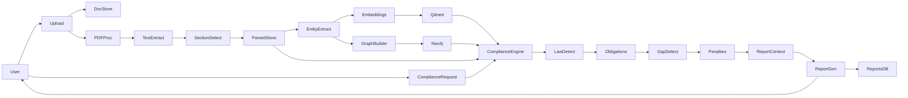

# PolarisLex — Project Plan

`document_pipeline/` ingests legal documents and writes parsed JSON. `vectorization/` embeds clauses into Qdrant. `graph_builder/` / `semantic_graph/` build GraphIR and can export to Neo4j. Overlay compare (`POST /compare`), India analysis (`POST /analyze`), and LLM reports (`POST /report`) are built. Hybrid graph+vector fusion waits until GraphIR has Obligation nodes.

An older rewrite brief lives at `.cursor/plans/optimize_plan.md_e883823e.plan.md`. It is historical (how this file was first slimmed). Do not execute its Phase 1 list.

## Architecture

```mermaid
flowchart LR
  User --> Upload --> DocStore
  Upload --> PDFProc --> TextExtract --> SectionDetect --> ParsedStore
  ParsedStore --> EntityExtract --> Embeddings --> Qdrant
  EntityExtract --> GraphBuilder --> Neo4j
  User --> ComplianceRequest --> ComplianceEngine
  ParsedStore --> ComplianceEngine
  Qdrant --> ComplianceEngine
  Neo4j --> ComplianceEngine
  ComplianceEngine --> LawDetect --> Obligations --> GapDetect --> Penalties --> ReportContext --> ReportGen --> ReportsDB
  ReportGen --> User
```

Parsed store today is `document_pipeline/output/DOC_*.json`. Vectors live in Qdrant. Graph lives in Neo4j when exported. There is no app DB (no SQLite/Postgres).

## Current state

| Area                             | Status                                                                                                                                                                                                                               |
| -------------------------------- | ------------------------------------------------------------------------------------------------------------------------------------------------------------------------------------------------------------------------------------ |
| `document_pipeline` orchestrator | End-to-end: loader (txt/pdf/docx/html) → cleaner → section_extractor → block_extractor → clause_builder → clause_extractor → document_understanding → context_builder → entity_extractor → `DefaultLLMPreparer`                      |
| CLI                              | `document-pipeline preview` calls `create_default_orchestrator()`; JSON includes `clauses`, `contextual_clauses`, `entity_clauses`                                                                                                   |
| Heading regression               | Six synthetic policies in `document_pipeline/tests/fixtures/policies/` with gold title lists                                                                                                                                         |
| `vectorization`                  | Ingest, search, skip/split, EmbeddingProvider, richer JSON, KG JSON ingest (`ingest-kg`), `reembed`. Parked: LLM `retrieval_text` (Spec 4)                                                                                           |
| Graph                            | GraphIR dump (`semantic-graph dump-ir`) → `graph-builder-export-kg` → `kg_export/*.json`. Neo4j via `semantic-graph export`.                                                                                                         |
| Overlay match                    | Keywords still group User Graph clusters (`TOPIC_KEYWORDS`). Not used for scores or graph colors.                                                                                                                                    |
| Analyze v1                       | `compliance/` + `POST /analyze`: Qdrant `kg_obligation`, top-1 hit + title-token gate, law-JSON penalties (India). UI stats and graph colors come from this result. `POST /report` writes a local Qwen narrative from the same JSON. |
| Next                             | GraphIR Obligation nodes, then hybrid graph+vector fusion                                                                                                                                                                            |
| Not built                        | Statute-level legal match (GraphIR Obligation / Neo4j), hybrid fusion, app DB, pluggable jurisdictions                                                                                                                               |

Entity extraction stays dictionary/regex (`ClassifierFn` already exists). No LLM classifier in this phase.

**~205** `document_pipeline` tests excluding `tests/test_loader.py` (needs `reportlab` extra). Vectorization has its own pytest suite.

## Phase 1 — Document intelligence

- [x] Wire `document_understanding` → `context_builder` → `entity_extractor` after `clause_extractor`
- [x] Concrete `DefaultLLMPreparer` on `EntityDocument`
- [x] Unify `preview` with orchestrator; nested context/entity in preview JSON
- [x] Synthetic policy fixture library + heading-detector patches
- [x] Keep dictionary/regex entities (no LLM swap-in)
- [x] HTML parser (`.html` / `.htm`)
- [x] Update `document_pipeline/README.md` status (not a skeleton)

- SQLite parsed store — **won't do**; JSON files are the store

## Phase 2 — Embeddings + Qdrant

Package: `vectorization/`. Local Qdrant via root `docker-compose.yml`; default embedder is Ollama `nomic-embed-text`.

- [x] Embed at clause level (unwrap `entity_clauses` / `contextual_clauses` when present)
- [x] Local embedding backend (Ollama default; optional Sentence Transformers)
- [x] Qdrant collection `document_clauses`
- [ ] Optional Spec 4: LLM `retrieval_text` rewrite (parked; needs a chat model; mostly skipped as it affects latency)
- [x] Live batch ingest when ready (`vectorization` then `ingest-kg`, or `reembed`)
- [x] GraphIR → `kg_export` JSON dump so obligation search has law text (not SQLite)

## Phase 3 — Policy graph + Neo4j

Packages: `graph_builder/`, `semantic_graph/`.

- [x] GraphIR schema and Neo4j export path
- [x] Save GraphIR JSON to disk (`semantic-graph dump-ir`, or `export --ir-output`)
- [x] Exporter into the `kg_export` file shape (`law_code`, `sections`, `obligations`)
- [x] Idempotent re-ingest tests against a running Neo4j if not already covered

- Hybrid graph+vector fusion — **after Phase 5**, and only after GraphIR has Obligation nodes (`dump-ir` is still Document/Section/Clause). Same work as statute-level legal match; blocked today.

## Phase 4 — Compliance engine

- [x] Policy overlay UI (`policy_compare` + Docker `web`/`api`)
- [x] Overlay keywords kept only for User Graph clustering (Consent vs Extra). **Not** the coverage score. Do **not** add overlay embeddings unless clustering looks wrong — see [Later — matching](#later--matching).
- [x] API v1: `POST /analyze` (upload + optional `jurisdiction` default `IN`) → `AnalysisResult`. Document-ID lookup of stored `DOC_*.json` is later.
- [x] Pull parsed JSON + Qdrant `kg_obligation` + four law JSON files (penalties). Neo4j obligation traversal is later (`dump-ir` still has no Obligation nodes).
- [x] Match v1: each policy clause credits only its best catalog hit; **covered** also needs title-token overlap (generic privacy jargon cannot cover unrelated duties). Gaps = missing + partial. Output is `AnalysisResult`, not pipeline `context_builder`.
- [x] Inspector + metric strip + graph node colors follow analyze (green covered, orange partial, red missing), not keyword overlay.
- [x] **Decision:** single-framework MVP (India website privacy). Pluggable jurisdictions later.

## Phase 5 — Report generation + Reports DB

Reports consume the existing `AnalysisResult` (no Neo4j required). Hybrid memo: engine owns every duty row; Qwen only writes the summary and per-law notes. `POST /report` + `POST /report.pdf`. Optional JSON persist via `POLARIS_REPORT_DIR`.

- [x] LLM report from structured `AnalysisResult` (not free-form): applicable law, obligations, gaps, penalties
- [x] Show the full memo in the existing Validation report panel (covered rows included), not a gap teaser
- [x] `POST /report.pdf` — deterministic ReportLab PDF from the assembled report JSON (no second chat call)
- [x] Chat down: `/report` still 200 with `narrative_available: false`; PDF still downloads
- [x] Persist reports by document ID + analysis run (still no SQLite unless we explicitly add a reports store)

## Later — matching

**Skip overlay embeddings and hybrid fusion for now.** Analyze already uses Qdrant. The UI paints graphs from `AnalysisResult`. Keywords still group User Graph clusters only.

Order after Phase 5:

1. **User Graph clustering (optional)** — embeddings or LLM labels so sections land in the right topic folder. Only if Extra/Consent grouping looks wrong. Needs Qdrant + Ollama on `/compare`.
2. **GraphIR Obligation nodes** — LLM GraphBuilder / enrichment so `dump-ir` has obligations, not just Section/Clause. Required before Neo4j traversal.
3. **Hybrid graph+vector fusion** — Cypher (citations, penalties, Obligation nodes) plus Qdrant. “This clause satisfies DPDP §X” (child under 18, DPO, consent manager). Strict vector+title cannot do that.

Out of scope until Obligation nodes exist: Neo4j join at analyze time, changing `KEPT_TOPICS`, ingest-on-analyze, pluggable jurisdictions.

## Decisions

- **Privacy:** local Ollama embeddings by default; cloud embedders are a settings swap, not the default.
- **Naming:** structural `ContextBuilder` is document structure only. Engine output is `AnalysisResult` (findings).
- **Schema:** LLM stages validate against pydantic before downstream use (`ClassificationResult`, `Entity`, `Reference`).
- **Stores:** JSON parsed artifacts, Qdrant vectors, Neo4j graph. No SQLite.

Each phase should end with a real-document run before moving on.