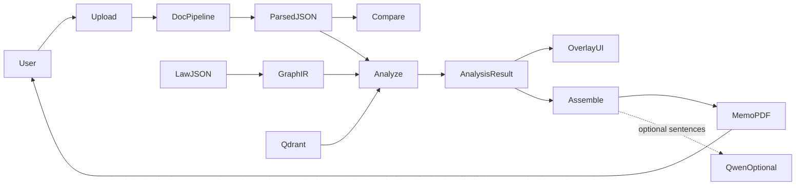

# PolarisLex — Project Plan

`document_pipeline/` ingests legal documents and writes parsed JSON. `vectorization/` embeds clauses into Qdrant. `graph_builder/` / `semantic_graph/` build GraphIR and can export to Neo4j. Overlay compare (`POST /compare`), India analysis (`POST /analyze`), and client memos (`POST /report` + `/report.pdf`) are built. `/analyze` scores in-process GraphIR Obligation nodes with Qdrant (no Bolt). The memo’s Themes, scoreboard sentence, filename, and priority gaps are engine-owned; local Qwen may append extra summary sentences.

An older rewrite brief lives at `.cursor/plans/optimize_plan.md_e883823e.plan.md`. It is historical (how this file was first slimmed). Do not execute its Phase 1 list.

## Architecture

```mermaid
flowchart LR
  User --> Upload
  Upload --> DocPipeline --> ParsedJSON
  ParsedJSON --> Compare
  LawJSON --> GraphIR
  GraphIR --> Analyze
  Qdrant --> Analyze
  ParsedJSON --> Analyze
  Analyze --> AnalysisResult
  AnalysisResult --> OverlayUI
  AnalysisResult --> Assemble
  Assemble --> MemoPDF
  Assemble -.->|optional sentences| QwenOptional
  MemoPDF --> User
```

Parsed store today is `document_pipeline/output/DOC_*.json`. Vectors live in Qdrant. GraphIR for `/analyze` is built in-process from the four law JSON files; Neo4j is optional export only (unused on compare/analyze/report). There is no app DB (no SQLite/Postgres). Optional `POLARIS_REPORT_DIR` JSON files only.

## Current state

| Area                             | Status                                                                                                                                                                                                                                                                               |
| -------------------------------- | ------------------------------------------------------------------------------------------------------------------------------------------------------------------------------------------------------------------------------------------------------------------------------------ |
| `document_pipeline` orchestrator | End-to-end: loader (txt/pdf/docx/html) → cleaner → section_extractor → block_extractor → clause_builder → clause_extractor → document_understanding → context_builder → entity_extractor → `DefaultLLMPreparer`                                                                      |
| CLI                              | `document-pipeline preview` calls `create_default_orchestrator()`; JSON includes `clauses`, `contextual_clauses`, `entity_clauses`                                                                                                                                                   |
| Heading regression               | Six synthetic policies in `document_pipeline/tests/fixtures/policies/` with gold title lists                                                                                                                                                                                         |
| `vectorization`                  | Ingest, search, skip/split, EmbeddingProvider, richer JSON, KG JSON ingest (`ingest-kg`), `reembed`. Parked: LLM `retrieval_text` (Spec 4)                                                                                                                                           |
| Graph                            | GraphIR dump (`semantic-graph dump-ir`) → `graph-builder-export-kg` → `kg_export/*.json`. Catalog duties: `semantic-graph from-catalog`. Neo4j via `semantic-graph export` / `from-catalog --to-neo4j`.                                                                              |
| Overlay match                    | Keywords still group User Graph clusters (`TOPIC_KEYWORDS`). Not used for scores or graph colors.                                                                                                                                                                                    |
| Analyze v1                       | `compliance/` + `POST /analyze`: in-process GraphIR Obligation nodes, Qdrant `kg_obligation` scores (top-1 + title-token gate), `PENALIZES` walk (India). UI stats, graph colors, and the report-page coverage strip come from this result. |
| Report                           | `POST /report` + `POST /report.pdf`. Engine owns duty rows, per-law Themes (2–3 missing/partial titles), scoreboard first sentence, `source_filename`, and `priority_gaps` (cap 5). Qwen may append extra summary sentences. Chat down: scoreboard still shows (`narrative_available: false`). |
| Next                             | Cloud chat is still [Later B](#b--report-polish). Cypher at analyze time and `applies_if` are still later.                                                                                                                                                                         |
| Not built                        | Neo4j Cypher at `/analyze`, `applies_if` / NOT_APPLICABLE, app DB, pluggable jurisdictions, cloud chat                                                                                                                                                                               |

Entity extraction stays dictionary/regex (`ClassifierFn` already exists). No LLM classifier in this phase.

**~205** `document_pipeline` tests excluding `tests/test_loader.py` (needs `reportlab` extra). Vectorization has its own pytest suite.

## Phase 1 — Document intelligence

- [x] Wire `document_understanding` → `context_builder` → `entity_extractor` after `clause_extractor`
- [x] Concrete `DefaultLLMPreparer` on `EntityDocument`
- [x] Unify `preview` with orchestrator; nested context/entity in preview JSON
- [x] Synthetic policy fixture library + heading-detector patches
- [x] Keep dictionary/regex entities (no LLM swap-in)
- [x] HTML parser (`.html` / `.htm`)
- [x] Update `document_pipeline/README.md` status (not a skeleton)

- SQLite parsed store — **won't do**; JSON files are the store

## Phase 2 — Embeddings + Qdrant

Package: `vectorization/`. Local Qdrant via root `docker-compose.yml`; default embedder is Ollama `nomic-embed-text`.

- [x] Embed at clause level (unwrap `entity_clauses` / `contextual_clauses` when present)
- [x] Local embedding backend (Ollama default; optional Sentence Transformers)
- [x] Qdrant collection `document_clauses`
- [ ] Optional Spec 4: LLM `retrieval_text` rewrite (parked; needs a chat model; mostly skipped as it affects latency)
- [x] Live batch ingest when ready (`vectorization` then `ingest-kg`, or `reembed`)
- [x] GraphIR → `kg_export` JSON dump so obligation search has law text (not SQLite)

## Phase 3 — Policy graph + Neo4j

Packages: `graph_builder/`, `semantic_graph/`.

- [x] GraphIR schema and Neo4j export path
- [x] Save GraphIR JSON to disk (`semantic-graph dump-ir`, or `export --ir-output`)
- [x] Exporter into the `kg_export` file shape (`law_code`, `sections`, `obligations`)
- [x] Idempotent re-ingest tests against a running Neo4j if not already covered

- [x] Hybrid graph+vector fusion — **[Later A](#a--matching)**. `/analyze` uses in-process GraphIR Obligation nodes + `PENALIZES`; Qdrant only scores those ids. Default `dump-ir` is still Document/Section/Clause; catalog duties come from `from-catalog` / `catalog_to_graph_ir`.

## Phase 4 — Compliance engine

- [x] Policy overlay UI (`policy_compare` + Docker `web`/`api`)
- [x] Overlay keywords kept only for User Graph clustering (Consent vs Extra). **Not** the coverage score. Overlay embeddings for folders — **won't do**; skip [Later A clustering](#a--matching).
- [x] API v1: `POST /analyze` (upload + optional `jurisdiction` default `IN`) → `AnalysisResult`. Document-ID lookup of stored `DOC_*.json` is later.
- [x] Pull parsed JSON + in-process GraphIR (Obligation nodes from the four law JSON files) + Qdrant `kg_obligation` scores. Penalties walk `PENALIZES`. Neo4j / Cypher at analyze time is still later.
- [x] Match v1: each policy clause credits only its best catalog hit; **covered** also needs title-token overlap (generic privacy jargon cannot cover unrelated duties). Gaps = missing + partial. Output is `AnalysisResult`, not pipeline `context_builder`.
- [x] Inspector + metric strip + graph node colors follow analyze (green covered, orange partial, red missing), not keyword overlay. The Report page shows the same coverage strip.
- [x] **Decision:** single-framework MVP (India website privacy). Pluggable jurisdictions later.

## Phase 5 — Report generation + Reports DB

Reports consume the existing `AnalysisResult` (no Neo4j required). Hybrid memo: engine owns every duty row, per-law Themes, the scoreboard sentence, filename, and priority gaps; Qwen may append extra summary sentences. `POST /report` + `POST /report.pdf`. Optional JSON persist via `POLARIS_REPORT_DIR`.

- [x] LLM report from structured `AnalysisResult` (not free-form): applicable law, obligations, gaps, penalties
- [x] Show the full memo on its own page (**View Report** after Qwen finishes; Findings stays the duty table). Coverage strip stays visible on that page.
- [x] `POST /report.pdf` — deterministic ReportLab PDF from the assembled report JSON (no second chat call)
- [x] Chat down: `/report` still 200 with `narrative_available: false`; PDF still downloads
- [x] Persist reports by document ID + analysis run (still no SQLite unless we explicitly add a reports store)
- [x] Per-law notes start with engine counts (`N covered, N partial, N missing`) plus engine Themes. Remaining Later B item is [cloud chat](#b--report-polish) only, not more Phase 5.

## Later

Same checkbox style as Phases 1–5. Mark items `[x]` when done. **A** matching is done at GraphIR-in-process. **B** memo polish is done except optional cloud chat.

### A — Matching

Priority. Done at GraphIR-in-process. Analyze uses GraphIR Obligation nodes as the duty set; Qdrant still scores with top-1 + title tokens. The UI paints graphs from `AnalysisResult`. Overlay folder clustering stays keywords.

- **User Graph clustering (optional)** — **won't do.** Extra/Consent folders do not change coverage scores. Skip overlay embeddings / LLM labels on `/compare`.
- [x] **GraphIR Obligation nodes** — `semantic-graph from-catalog` lifts tagged law JSON into GraphIR (`Obligation` ids match `/analyze`; `Penalty` + `PENALIZES`). Opt-in `dump-ir --enrich` extracts slot obligations from clause text (local Ollama; ids are `obl_<clause>_n`, not catalog ids). Default dump-ir stays Section/Clause only. `/analyze` still does not query Neo4j.
- [x] **Hybrid graph+vector fusion** — `/analyze` builds GraphIR in-process (`catalog_to_graph_ir`). Obligation nodes are the duty set; Qdrant scores those ids (top-1 + title gate); penalties walk `PENALIZES`. Findings copy names `{act}: {title}`. No Bolt. Cypher at analyze time and `applies_if` (child-under-18 / DPO / consent manager) still later.

Still later (not this slice): Neo4j join at analyze time, changing `KEPT_TOPICS`, ingest-on-analyze, pluggable jurisdictions, `applies_if`.

### B — Report polish

Mostly done. Memo + PDF are sendable. Do not fine-tune Qwen. Remaining item is optional cloud chat.

- [x] **Engine themes** — per-law `Themes:` from that act’s own missing/partial **titles** (2–3), not a free Qwen tag. Qwen `law_notes` are ignored. Qwen remainder after the scoreboard is optional.
- [x] **Summary scoreboard** — first sentence is always `This policy covers {covered} of {total} scored duties, with {partial} partial and {missing} missing.` Qwen may append sentences; it does not own sentence one.
- [x] **Status words** — themes come from engine titles, not Qwen. The model does not decide covered / partial / missing.
- [x] **PDF / UI** — upload filename on the memo and download name; short priority-gaps block (missing rows that have a scored penalty, cap 5). Report page shows the same coverage strip as Graph Validation (nodes / edges / coverage % / covered / partial / missing / gaps).
- [ ] **Cloud chat (optional, default off)** — `ChatFn` can later POST to an OpenAI-compatible API (e.g. DeepSeek). Default stays local Ollama. Compact JSON still leaves the machine (duty titles + gap pattern). Do not send the raw policy or embeddings. No provider in Compose until this item is explicitly picked.

## Decisions

- **Privacy:** local Ollama embeddings **and** local Qwen chat by default. Cloud embedders or cloud chat (DeepSeek, etc.) are a Later settings swap, default off — compact report JSON is still sensitive.
- **Naming:** structural `ContextBuilder` is document structure only. Engine output is `AnalysisResult` (findings).
- **Schema:** LLM stages validate against pydantic before downstream use (`ClassificationResult`, `Entity`, `Reference`).
- **Stores:** JSON parsed artifacts, Qdrant vectors, Neo4j graph. No SQLite.

Each phase should end with a real-document run before moving on. Mark Later checkboxes the same way.