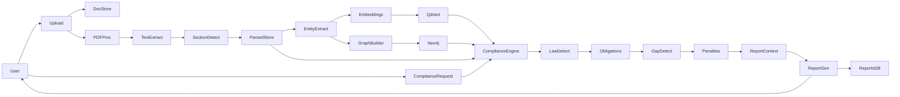

# PolarisLex — Project Plan

`document_pipeline/` ingests legal documents and writes parsed JSON. `vectorization/` embeds clauses into Qdrant. `graph_builder/` / `semantic_graph/` build GraphIR and can export to Neo4j. The compliance engine, reports, and APIs are not built.

An older rewrite brief lives at `.cursor/plans/optimize_plan.md_e883823e.plan.md`. It is historical (how this file was first slimmed). Do not execute its Phase 1 list.

## Architecture

```mermaid
flowchart LR
  User --> Upload --> DocStore
  Upload --> PDFProc --> TextExtract --> SectionDetect --> ParsedStore
  ParsedStore --> EntityExtract --> Embeddings --> Qdrant
  EntityExtract --> GraphBuilder --> Neo4j
  User --> ComplianceRequest --> ComplianceEngine
  ParsedStore --> ComplianceEngine
  Qdrant --> ComplianceEngine
  Neo4j --> ComplianceEngine
  ComplianceEngine --> LawDetect --> Obligations --> GapDetect --> Penalties --> ReportContext --> ReportGen --> ReportsDB
  ReportGen --> User
```

Parsed store today is `document_pipeline/output/DOC_*.json`. Vectors live in Qdrant. Graph lives in Neo4j when exported. There is no app DB (no SQLite/Postgres).

## Current state

| Area | Status |
|---|---|
| `document_pipeline` orchestrator | End-to-end: loader (txt/pdf/docx/html) → cleaner → section_extractor → block_extractor → clause_builder → clause_extractor → document_understanding → context_builder → entity_extractor → `DefaultLLMPreparer` |
| CLI | `document-pipeline preview` calls `create_default_orchestrator()`; JSON includes `clauses`, `contextual_clauses`, `entity_clauses` |
| Heading regression | Six synthetic policies in `document_pipeline/tests/fixtures/policies/` with gold title lists |
| `vectorization` | Ingest, search, skip/split, EmbeddingProvider, richer JSON, KG JSON ingest (`ingest-kg`), `reembed`. Parked: LLM `retrieval_text` (Spec 4) |
| Graph | GraphIR dump (`semantic-graph dump-ir`) → `graph-builder-export-kg` → `kg_export/*.json`. Neo4j via `semantic-graph export`. |
| Not built | Compliance engine, reports, APIs, app DB |

Entity extraction stays dictionary/regex (`ClassifierFn` already exists). No LLM classifier in this phase.

**~205** `document_pipeline` tests excluding `tests/test_loader.py` (needs `reportlab` extra). Vectorization has its own pytest suite.

## Phase 1 — Document intelligence

- [x] Wire `document_understanding` → `context_builder` → `entity_extractor` after `clause_extractor`
- [x] Concrete `DefaultLLMPreparer` on `EntityDocument`
- [x] Unify `preview` with orchestrator; nested context/entity in preview JSON
- [x] Synthetic policy fixture library + heading-detector patches
- [x] Keep dictionary/regex entities (no LLM swap-in)
- [x] HTML parser (`.html` / `.htm`)
- [x] Update `document_pipeline/README.md` status (not a skeleton)
- SQLite parsed store — **won't do**; JSON files are the store

## Phase 2 — Embeddings + Qdrant

Package: `vectorization/`. Local Qdrant via root `docker-compose.yml`; default embedder is Ollama `nomic-embed-text`.

- [x] Embed at clause level (unwrap `entity_clauses` / `contextual_clauses` when present)
- [x] Local embedding backend (Ollama default; optional Sentence Transformers)
- [x] Qdrant collection `document_clauses`
- [ ] Optional Spec 4: LLM `retrieval_text` rewrite (parked; needs a chat model)
- [ ] Live batch ingest when ready (`vectorization` then `ingest-kg`, or `reembed`)
- [x] GraphIR → `kg_export` JSON dump so obligation search has law text (not SQLite)

## Phase 3 — Policy graph + Neo4j

Packages: `graph_builder/`, `semantic_graph/`.

- [x] GraphIR schema and Neo4j export path
- [x] Save GraphIR JSON to disk (`semantic-graph dump-ir`, or `export --ir-output`)
- [x] Exporter into the `kg_export` file shape (`law_code`, `sections`, `obligations`)
- [ ] Idempotent re-ingest tests against a running Neo4j if not already covered
- Hybrid graph+vector fusion — later (compliance engine)

## Phase 4 — Compliance engine

- [x] Policy overlay UI (`policy_compare` + Docker `web`/`api`) — topic coverage, not full gap/penalty analysis
- [ ] API: document ID + optional jurisdiction → analysis
- [ ] Pull parsed JSON, Qdrant, Neo4j
- [ ] Steps: applicable law → obligations → missing clauses → penalties → compliance context (not `context_builder.py`)
- [ ] **Decision:** single-framework MVP vs pluggable jurisdictions (entity dict is DPDP/India-biased)

## Phase 5 — Report generation + Reports DB

- [ ] LLM report from structured compliance context (not free-form)
- [ ] Fixed sections: applicable law, obligations, gaps, penalties
- [ ] Persist reports by document ID + analysis run

## Decisions

- **Privacy:** local Ollama embeddings by default; cloud embedders are a settings swap, not the default.
- **Naming:** structural `ContextBuilder` vs compliance-level context — resolve before Phase 4.
- **Schema:** LLM stages validate against pydantic before downstream use (`ClassificationResult`, `Entity`, `Reference`).
- **Stores:** JSON parsed artifacts, Qdrant vectors, Neo4j graph. No SQLite.

Each phase should end with a real-document run before moving on.
